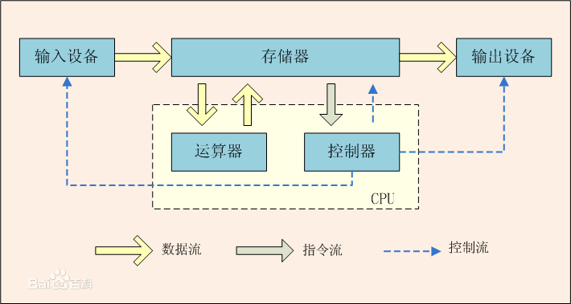
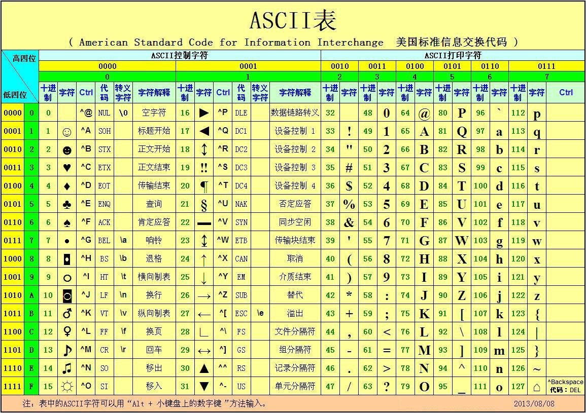

# 1 微型计算机基础

微型计算机是由大规模集成电路组成的、体积较小的电子计算机。按结构，从小到大可以分别分为三个层次：

- 中央处理器CPU、计算机、计算机系统
- 微处理器、微型计算机、微型计算机系统

## 电子计算机

> [百度百科](https://baike.baidu.com/item/计算机/140338)：计算机（computer）俗称电脑，是现代一种用于高速计算的电子计算机器，可以进行数值计算，又可以进行逻辑计算，还具有存储记忆功能。是能够按照程序运行，自动、高速处理海量数据的现代化智能电子设备。

### 电子计算机的历史

1946年2月14日，由美国军方定制的世界上第一台电子计算机“[电子数字积分计算机](https://baike.baidu.com/item/电子数字积分计算机)”（ENIAC Electronic Numerical And Calculator）在美国宾夕法尼亚大学问世。

1. 第一代电子管[^Vacuum-tube]计算机
2. 第二代晶体管[^transistor]计算机
3. 第三代集成电路计算机
4. 第四代大规模集成电路[^LSI]计算机和超大规模集成电路[^VLSI]计算机

[^Vacuum-tube]: 电子管，是一种最早期的电信号放大器件。[电子管：电子时代的到来 - 知乎 (zhihu.com)](https://zhuanlan.zhihu.com/p/144678115), [Vacuum tube - Wikipedia](https://en.wikipedia.org/wiki/Vacuum_tube)
[^transistor]: 晶体管（transistor）是一种固体半导体器件。[晶体管（电子元件）_百度百科 (baidu.com)](https://baike.baidu.com/item/晶体管/569042), [Transistor - Wikipedia](https://en.wikipedia.org/wiki/Transistor)
[^LSI]: Very large-scale integration
[^VLSI]: Very large-scale integration

### 计算机系统的基本组成

计算机系统通常可以分为硬件和软件两部分，大致可以进行如下划分：

- 硬件：泛指设备而言
  - 中央处理器(CPU,Central Processing Unit): 即微处理器，是超大规模集成电路，内部集成了运算器、控制器、存储器管理部件
    - 控制器(control unit)
    - 运算器(ALU,	Arithmetic logic unit )
    - 寄存器(registers)
  - 存储器(Memory): 指系统的主存储器，简称为内存。用来存放程序、数据
  - I/O接口(Input/Output Circuit): 是CPU和外部设备交换信息的“中转站”
  - I/O设备(Input/Outpt Device): 如键盘、显示器、打印机（注意：硬盘(外存储器)也是I/O设备！）
  - 电源系统等
- 软件：泛指程序而言
  - 系统软件，如操作系统
  - 应用软件：按任务需要编制成的各种程序

### 计算机的总线

微型计算机以CPU为核心通过3条总线连接存储器、I/O接口

- 总线:总线是CPU与存储器、I/O接口交换信息的公共通道。
  - AB地址总线： 传输CPU访问存储器，**访问**I/O端口的地址信号。
  - DB数据总线：传输CPU读/写内存，**读写**I/O端口时的数据。
  - CB控制总线：CPU**发出**的控制命令， 或外部向CPU**提出**的请求。

> 地址总线通常是单向总线，数据总线通常是双向总线， 大部分控制线是单向，少数是双向。

### 计算机体系结构

[计算机体系结构(一) 三大体系结构浅析 | 凯哥 (kaige86.com)](https://kaige86.com/post/computer-arch.html)

#### 冯诺依曼体系结构

冯·诺依曼结构，又称为普林斯顿体系结构，是一种将程序指令存储器和数据存储器合并在一起的存储器结构。

取指令和取操作数都在同一总线上，通过分时复用的方式进行；
缺点是在高速运行时，不能达到同时取指令和取操作数，从而形成了传输过程的瓶颈。
由于程序指令存储地址和数据存储地址指向同一个存储器的不同物理位置，因此程序指令和数据的宽度相同，如英特尔公司的8086中央处理器的程序指令和数据都是16位宽。

英特尔80x86系列处理器为冯诺依曼体系结构

#### 哈佛结构

哈佛结构是一种将程序指令存储和数据存储分开的存储器结构，它的主要特点是将程序和数据存储在不同的存储空间中，即程序存储器和数据存储器是两个独立的存储器，每个存储器独立编址、独立访问，目的是为了减轻程序运行时的访存瓶颈。

常见如80c51系列

## 微型计算机

### 微型计算机的定义

字面上看，微型计算机是体积较小的电子计算机。早期的计算机规模庞大，随着集成电路等相关技术的发展，计算机开始小型化。

> [百度百科](https://baike.baidu.com/item/微型计算机/9287): 微型计算机简称“微型机”、“微机”，由于其具备人脑的某些功能，所以也称其为“[微电脑](https://baike.baidu.com/item/微电脑/8510596)”。微型计算机是由[大规模集成电路](https://baike.baidu.com/item/大规模集成电路/7502206)组成的、体积较小的电子计算机。它是以微处理器为基础，配以内存储器及输入输出（I/0）接口电路和相应的[辅助电路](https://baike.baidu.com/item/辅助电路/847088)而构成的裸机

> [Wikipedia](https://en.wikipedia.org/wiki/Microcomputer): A **microcomputer** is a small, relatively inexpensive [computer](https://en.wikipedia.org/wiki/Computer) with a [microprocessor](https://en.wikipedia.org/wiki/Microprocessor) as its [central processing unit](https://en.wikipedia.org/wiki/Central_processing_unit) (CPU).[[2\]](https://en.wikipedia.org/wiki/Microcomputer#cite_note-2) It includes a microprocessor, [memory](https://en.wikipedia.org/wiki/Computer_memory) and minimal [input/output](https://en.wikipedia.org/wiki/Input/output) (I/O) circuitry mounted on a single [printed circuit board](https://en.wikipedia.org/wiki/Printed_circuit_board) (PCB)

### 微型计算机的分类

按照处理的位数可以分为1位，4位，8位，16位，32位和64位

按照组装方式可以分为：

- 单板机(Single-board Computer)
- 多板机: 在单板机的基础上，增加拓展版

- 个人计算机(Personal Computer, PC)
- 嵌入式计算机(Embedded System)

#### 嵌入式计算机

嵌入式计算机即嵌入式系统，是一种应用为中心，以微处理器为基础，软硬件**可裁剪**的，适应应用系统对功能、可靠性、成本、体积、功耗等综合性严格要求的**专用计算机系统**

嵌入式系统的核心部件是嵌入式处理器，可以分为四类专用处理器

1. 嵌入式微控制器(MCU, Micro Controller Unit)
2. 嵌入式微处理器(MPU, Micro Processor Unit)
3. 嵌入式数字信号处理器(DSP, Digital Signal Processor)
4. 嵌入式片上系统(SoC, System on Chip)

### 微型计算机的历史

| 时间       | 代                                   | 代表型号                                                     |
| ---------- | ------------------------------------ | ------------------------------------------------------------ |
| 1971       | 第一代微处理器(4、8位)               | Intel的4004（1971）、4040（4位）、8008（8位）                |
| 1973-1977  | 第二代微处理器                       | Intel的8080/8085、Zilog的Z80、Motorola的6800/6802和Rockwell的6502 |
| 1977年左右 | 超大规模规模集成电路为处理器（16位） | Intel的8086/8088、Zilog的Z8000、Motorola的M680000            |
| 1980年以后 | 16位                                 | Intel 80286、Motorola 65010                                  |
| 1983年以后 | 32位处理器                           | Intel 80386、Motorola 68020                                  |
| 1989-1995  |                                      | Intel 80486、Pentium...                                      |
| 2001       | 首个64位处理器                       | Itanium...                                                   |

## 计算机中的信息表示、编码与运算

### 进位计数制（数制）

数制由基数R和各数位的权W两大要素组成。

计算机系统中一般采用二进制数。

| 4位二进制数 | 等值十六进制数 | 4位二进制数 | 等值十六进制数 |
| :---------: | :------------: | :---------: | :------------: |
|    0000     |       0        |    1000     |       8        |
|    0001     |       1        |    1001     |       9        |
|    0010     |       2        |    1010     |       A        |
|    0011     |       3        |    1011     |       B        |
|    0100     |       4        |    1100     |       C        |
|    0101     |       5        |    1101     |       D        |
|    0110     |       6        |    1110     |       E        |
|    0111     |       7        |    1111     |       F        |

#### 进制转换

十进制转二进制：（整数）除二取余，（小数）乘二取整

> [十进制小数转化为二进制小数 | 菜鸟教程 (runoob.com)](https://www.runoob.com/w3cnote/decimal-decimals-are-converted-to-binary-fractions.html)

### 数值编码

#### 数值在计算机中的表示

1. **真值**：一个数的数值。
3. **字长**：包括符号位在内，一个二进制数占有的位数如：字长n=8的二进制数，除了符号位，数值部分为7位
3. **模的概念**：一个计量器的最大容量称为该计量器的“模”

| n位计量器 | 存储数据范围        | 模             |
| --------- | ------------------- | -------------- |
| 四        | 0000~1111           | $2^{4}=16$     |
| 八        | 0000,0000~1111,1111 | $2^{8}=256$    |
| 十六      |                     | $2^{16}=65536$ |

**机器数**：把符号数值化，用0表示“+”，用1表示“-”，这样，连同符号位在一起作为一个数，称为机器数。

1. **原码**：表示的有符号数，最高位为符号位，数值位部分就是该数的绝对值
2. **反码**：表示的有符号数，也是把最高位规定为符号位，但数值部分*对于正数是其绝对值*，而**对于负数则是其绝对值按位取反(即1变0，0变1)**。
3. **补码**：表示的有符号数，*对于正数来说同原码、反码一样*，但**负数的数值位部分为其绝对值按位取反后末位加1所得**。

Tip1: 

- **正数**的原码、反码、补码是一样的
- **负数**的反码为原码取反 补码是取反加一

#### 补码扩充了机器数的数值范围

设机器数字长为n位,用来表示整数,则n位补码数,其真值范围为 $-2^{n-1} \sim +2^{n-1} - 1$，共$2^n$个数

以模8为例，假如是有符号数，假如使用原码表示，如下图，真值零有两种编码来表示，使用补码相当于先把真值为零或负值的部分编码颠倒再向下扩充了一位，其可以表示的真值范围为 $-2^7\sim 2^7-1$。

|真值|原码|反码|补码|
|----|---|----|---|
|127|0 111 1111|0 111 1111|0 111 1111|
|...||||
|1|0 000 0001|0 000 0001|0 000 0001|
|0|0 000 0000或 1 000 0000|0 000 0000 1 111 1111|0 000 0000|
|-1|1 000 0001|1 111 1110|1 111 1111|
|...||||
|-126|1 111 1110|1 000 0001|1 000 0010|
|-127|1 111 1111|1 000 0000|1 000 0001|
|-128|无法表示|无法表示|1 000 0000|

### 整数补码的加减运算

$$
\begin{aligned}
[ x+y ]_\text{补} &= [x]_\text{补}+[y]_\text{补}
\\
[ x-y ]_\text{补} &= [x]_\text{补}+[-y]_\text{补}
\end{aligned}
$$

补码加减运算的条件：

1. 符号位参加运算
2. 以$2^n$为模(*n*为字长)
3. 当真值满足 $-2^{n-1}\leq x, y, x\pm y < +2^{n-1}$ 时，结果是正确的，否则结果错误，可以通过标志位信息判断是否正确

#### 溢出与进位的概念

- **进位**：运算后，最高位向更高位的进位值。
- **溢出**：运算结果超出了运算器所能表示的范围。

#### 判断运算结果是否正确

1. 运算器对有符号数和无符号数同样对待
2. 最高位的进位值保存在“进位标志寄存器”中
3. 如**加数与被加数的最高位相同，却与结果的最高位相异**，则将溢出标志置为1

判断规则：

- 如果参与运算的数是无符号数，则判进位标志CF，进位标志=1，表示溢出错。
- 如果参与运算的数是有符号数，则判溢出标志OF，溢出标志=1，表示溢出错。

### 字符编码表示

计算机中主要通过BCD码来存储数字，使用ASCII码来存储字符（ASCII码有7位，通常使用一个字节（八位）表示）。对于各种语言支持的编码目前比较流行[UTF-8_百度百科 (baidu.com)](https://baike.baidu.com/item/UTF-8/481798)

| 常见字符 | 十进制ASCII码 | 十六进制ASCII码 | 常见字符 | 十进制ASCII码 | 十六进制ASCII码 |
| -------- | ------------- | --------------- | -------- | ------------- | --------------- |
| '\r'     | 13            | 0DH             | '\n'     | 10            | 0AH             |
| '0'      | 48            | 30H             | '9'      | 57            | 39H             |
| 'A'      | 65            | 41H             | 'Z'      | 90            | 5AH             |
| 'a'      | 97            | 61H             | 'z'      | 122           | 7AH             |

