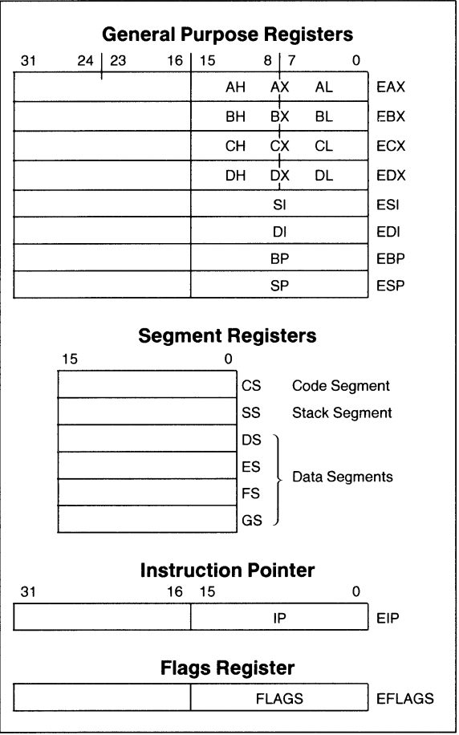
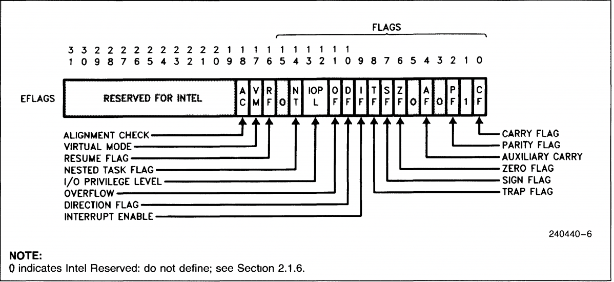
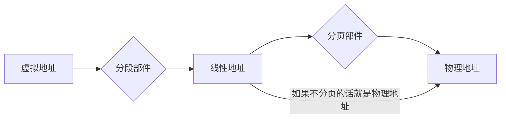

# 2 80x86微处理器

本章节讨论intel的80x86微处理器，重点结合80486介绍32位处理器的相关内容，
Intel官方参考手册可以从链接1获取,80486的datasheet可以从链接2获取。以这两个文件为准

1. [Intel® 64 and IA-32 Architectures Software Developer Manuals](https://software.intel.com/content/www/us/en/develop/articles/intel-sdm.html)
   1. `volume 1 2.1` BRIEF HISTORY OF INTEL® 64 AND IA-32 ARCHITECTURE
2. [intel :: 80486 :: i486 Microprocessor Data Sheet Apr89 : Free Download, Borrow, and Streaming : Internet Archive](https://archive.org/details/bitsavers_intel80486ataSheetApr89_12763574/page/n5/mode/2up)
   1. `2.1` Register Set 

## 微处理器

### 微处理器技术指标

- 位与字节
- 字长（数据宽度）：CPU一次能处理的数据位数
- 寻址能力
- 主频，也叫时钟频率，用来表示微处理器的运行速度
- MIPS（Millions of Instruction Per Second)，用来表示为初期的性能--运算速度
- 微处理器集成度，指微处理器芯片上集成的晶体管的密度

### 微处理器的功能模块

- 基本功能模块
  - 总线接口单元BIU（取指令）（寄存器组）
  - 执行单元EU（执行指令）（运算器和控制器、寄存器组）

- 微处理器的功能拓展模块
  - 存储管理(分段和分页部件)
  - 指令和数据流水线
  - 指令和数据CACHE
  - 指令预取
  - 浮点处理
  - 分支预测
  - 并行计算等等

## 32位处理器的寄存器组

486内部寄存器组(Register Set)分为4类：（应用程序只能访问基本结构寄存器和浮点寄存器）

- 基本结构寄存器( Base Architecture Registers )
  - 通用寄存器(General Purpose Registers )
  -  指令指针寄存器(Instruction Pointer)
  -  标志寄存器(Flags Register)
  - 段寄存器(Segment Registers)
  - Segment Descriptor Cache Registers
- 浮点寄存器
- 系统级寄存器
- 调试测试寄存器

### 基本结构寄存器

#### 通用寄存器

| 32位名称 | 16位名称[^211] | **名称**           |                            |
| -------- | -------- | ------------------ | -------------------------- |
| EAX  | AX   | 累加器         | AX (accumulater)       |
| EBX  | BX   | 基址寄存器     | BX (Base)        |
| ECX  | CX   | 计数器         | CX (Count)       |
| EDX  | DX   | 数据寄存器     | DX (Data)        |
| ESP  | SP   | 堆栈指针       | SP (Stack Pointer) |
| EBP  | BP   | 基址指针       | BP (Base Pointer) |
| EDI  | DI   | 目的变址寄存器 | DI (Destination Index) |
| ESI  | SI   | 源变址寄存器   | SI (Source Index) |
|EIP| IP |指令指针| IP (Instruction Pointer） |

- AX、BX、CX、DX共同点
  - 既可作为16位寄存器来用又可作为两个8位寄存器（高、低位）来用；
  - AX,BX,CX,DX,前8位称为AH,BH,CH,DH, 后8位称为AL,BL,CL,DL
  - 都是用于暂存操作数，或是运算的中间结果或其它一些信息
- SP、BP、SI、DI、IP：为寻址存贮单元提供偏移地址。

#### 段寄存器

CS代码、DS数据、ES附加、SS堆栈------4个段寄存器，和偏移地址寄存器一起形成20位存储器物理地址，对存储器中存放的程序、数据、堆栈区域加以区别、寻址。

- 寻址程序(指令)：CS＋IP；
- 寻址数据：(DS或ES)＋(SI或DI、BX、BP)；
- 寻址堆栈：SS＋(SP或BP)

#### 标志寄存器

标志寄存器FLAGS又称为程序状态字PSW，为16位寄存器，该寄存器主要有两个作用：

1. 记录CPU运行结果状态标志；
2. 提供控制标志。

根据功能，8086的标志可以分为两类：

- 状态标志：表示前面的操作执行后，算术逻辑部件处在怎样一种状态，这种状态会像某种先决条件一样影响后面的操作。有SF、ZF、PF、CF、AF和OF。
- 控制标志：每个控制标志都对某一种特定的功能起控制作用。指令系统中有专门的指令用于控制标志的设置和清除。有DF、 IF、 TF。

状态标志

| 状态标志符号  | 符号名称             | 标志为1的条件，否则为0                                  |
| ------------- | -------------------- | ------------------------------------------------------- |
| C进位标志     | Carry Flag           | 当**结果最高位**产生一个进位或借位                      |
| O溢出标志     | Overflow Flag        | **加数与被加数**最高位相同并且与**结果****不同**        |
| S符号标志     | Sign Flag            | **结果最高位**为1                                       |
| Z零标志       | Zero Flag            | **运算结果**为0                                         |
| P奇偶标志     | Parity Flag          | **结果低八位**中‘1’的个数为偶数（类似于奇效验）                     |
| A辅助进位标志 | Auxitiary Carry Flag | 操作时，由**低半字节（第3位）**向高半字节，有进位或借位 |

程序员判断溢出的方法

- 有符号数运算，判O标志，O标志为1，有溢出
- 无符号数矫健，判C标志，C标志为1，有溢出

### 系统级寄存器

1. 控制寄存器
2. 系统地址寄存器
3. 调试与测试寄存器

### 浮点寄存器

1. 数据寄存器
2. 标志寄存器
3. 状态寄存器
4. 控制字寄存器
5. 指令指针寄存器和数据指针寄存器

## 32位微处理器工作模式

### 实地址模式(实模式)

1. 加电、复位之后，486自动工作在实模式，系统在DOS管理下
2. 在实模式下，486只能访问第一个1M内存(00000H~FFFFFH)
3. 存储管理部件对存储器只进行分段管理，没有分页功能，每一逻辑段的最大容量为64K。
4. 在实模式下，段寄存器中存放段基址。

### 保护虚拟地址模式(保护模式)

486工作在保护模式下，才能真正发挥它的设计能力。

1. 在保护模式下，486支持多任务操作系统
2. 在保护模式下，486可以访问4G物理存储空间
3. 存储管理部件中，对存储器采用分段和分页管理

### 虚拟86模式

虚拟86模式是保护模式下的一种特殊工作模式,可运行实模式程序。
在操作系统管理下,486可以分时地运行多个实模式程序。
例如：有3个任务,操作系统为每一个任务分配1ms,每通过1ms就发生一次任务切换,从宏观上看系统是在执行多个任务。

关于保护机制：高级别的程序可以访问同级或低级的数据段，反之则不行

## 32位微处理器的地址空间

32位微处理器的地址空间包括存储地址空间、I/O地址空间。

#### 存储地址空间

80x86系列的32位微处理器有3个明确的存储地址空间，分别是物理空间、虚拟空间和线性空间。

##### 物理空间

物理空间是计算机中主存储器的实际空间，也称为主存空间，相应的地址称为物理地址或主存地址。

例如：486有32条地址线，内存最大容量4GB($2^{32}B$)。这4G字节称为物理存储器，每一单元的地址称为物理地址，其地址范围：`0000,0000H`~`FFFF,FFFFH`为物理存储空间。

##### 虚拟空间

虚拟空间又称为逻辑空间，是程序员编写程序的空间，此空间对应的存储器称为虚拟存储器，该存储空间对应的地址称为虚拟地址或逻辑地址。

>虚拟存储器(Virtual Memory)是一项硬件和软件结合的技术。
>
>存储管理部件把主存(物理存储器)和辅存(磁盘)看作是一个整体，即虚拟存储器。允许编程空间[^关于虚拟空间的争议]为$2^{46}=64T$，程序员可在此地址范围内编程，程序可大大超过物理空间。
>
>运行时，操作系统从虚拟空间取一部分程序载入物理存储器运行。当程序运行需要调用的程序和要访问的数据不在物理存储器时，操作系统再把那一部分调入物理存储器.……数据的交换极快，程序察觉不到。

[^关于虚拟空间的争议]: [386处理器的64TB的虚拟寻址空间，对我们的使用，有什么现实意义吗？ - 知乎 (zhihu.com)](https://www.zhihu.com/question/61205718)

##### 线性空间

   当程序从虚拟空间调入物理空间时，要进行地址转换。

- 实模式：存储空间仅分段，而不分页；
- 保护模式：存储空间先分段，再分页。

#### I/O空间

486利用低16位地址线访问I/O端口，所以I/O端口最多有$2^{16}=64K$，I/O地址空间为`0000H`～`FFFFH`。
注意：

- I/O地址空间不分段
- I/O地址空间与存储空间不重叠
- CPU有一条控制线M/IO，在硬件设计上用$M/\overline{IO}=1$，参与存储器寻址，用$M/\overline{IO}=0$参与I/O寻址。
- 从PC/XT～Pentium，基于Intel微处理器的系统机，实际上只使用低10位地址线，寻址$2^{10}=1024$个I/O端口。

## 实模式下，物理地址的形成

### 存储器的分段管理

存储空间为$2^{20}B=1MB$而寄存器为16 位，无法只使用一个寄存器寻址，所以需要分段管理，存储空间分段每段为64K（$2^{16}$）。

存储器中的每个存储单元都可以用两个形式的地址来表示：物理地址和逻辑地址。物理地址是指1MB存储区域中的某一单元地址，地址信息是20位的二进制代码，以16进制表示是`0 0000H`~`F FFFFH`中的一个单元，CPU访问存储器时，地址总线上送出的是物理地址。编制程序，则采用逻辑地址。

逻辑地址由段基址和偏移量组成，需由程序员在编程时给出，由一下段基址和便宜地址两部分组成。

- 段  基  址：在一个逻辑段中,各单元的段基址是相同的。编程中指明由段寄存器即可
- 偏移地址：偏移地址是该单元相对于段首的地址偏移量。编程中在程序中给出具体值，存放在相应的寄存器中

|逻辑地址|物理地址|
|---|----|
|`段基址(16位)`: `偏移地址(16位)`|`段基址*16+偏移地址`|

Tips:

- 所有段都是起始于16字节的边界
- 物理地址是唯一的，不同的逻辑地址可得到相同的物理地址。如：
  - `2000H：0200H`--`20200H`
  - `2010H：0100H`--`20200H`

### 实模式下各逻辑段物理地址的形成

**在实模式下(16位寻址)**,段寄存器存放相应逻辑段的段基址

| 逻辑段 | 段基址存放在 | 偏移地址存放在                        |
|----|----|--|
|代码段   |   CS        |     IP|
|堆栈段     | SS     |        SP|
|数据段     | DS            |根据不同的寻址方式 选择BX、BP、SI、DI|
|附加段   |ES/FS/GS      | 根据不同的寻址方式 选择BX、BP、SI、DI|

- 代码段：$CS\times2^4+IP$ =指令单元的物理地址。一条指令的一个字节取出后，IP自动加1，指向下一字节。
- 堆栈段：$SS\times2^4+SP$ =栈顶单元的物理地址
- 数据段：$DS\times 2^4$+偏移地址 =数据单元的物理地址

### 段寄存器和指针寄存器的初值

- CS、IP的初值：由操作系统赋值
- SS、SP的初值：
  1. 由程序员赋值
  2. 由操作系统自动赋值
- DS/ES/FS/GS的初值：由程序员赋值。
- BX/SI/DI/BP的初值：由程序员赋值。
