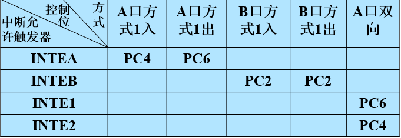

# 10 并行I/O 接口

8255A是Intel公司的产品，是一种可编程的并行接口芯片，通常作为微机系统总线与外部设备的并行接口控制部件，可通过软件编程来设置芯片的工作方式。
使用8255A连接外部设备时，通常不需要附加外部电路，给使用带来很大的方便。

- 8.1 可编程并行I/O接口芯片8255A
  - 内部结构及外部引脚
  - 工作方式
    - 基本型输入输出
    - 选通型输入输出
    - 双向数据传送
  - 控制字和初始化编程
  - 8255A应用举例
- 8.2 打印机并行接口

## 可编程并行I/O接口芯片8255A的内部结构及引脚


- 与CPU的接口
  - 数据总线缓冲器
  - 读/写控制逻辑
- 内部逻辑
  - A组 控制
  - B组 控制
- 外设接口
  - A组 A口 PA~7~ ~PA~0~
    - A组 C口上半部 PC~7~ ~PC~4~
    - B组 C口下半部 PC~3~ ~PC~0~
  - B组 B口 PB~7~ ~PB~0~

8255A是双列直插式，40（24+8+2+6）个引脚

1. 24根端口数据线——接外设(A口、B口、C口）
2. 8根系统数据线——接CPU数据总线D~7~~D~0~
3. 电源线：+5V，地线
4. 6根输入控制线

- RESET：复位信号，RESET=1时，8255内部复位，所有内部寄存器清零，A、B、C三个端口自动为基本型(方式0)输入口
  - $\overline{CS}$：片选信号，CS=0时，该芯片被选中
  - $\overline{RD}$：来自CPU的I/O读命令
  - $\overline{WR}$：来自CPU的I/O写命令
  - A1、A0：接CPU的地址线A1、A0

### 端口地址

1. 端口：**接口电路中能和CPU直接交换信息的寄存器**  8255A有4个端口寄存器
2. 与非门前要都是1才能输入0，片选选中
   如果系统产生片选信号的译码电路如图，则：(00 0110 00A1A2)

- A数据口地址=60H
- B数据口地址=61H
- C数据口地址=62H
- 控制口地址=63H


| CS| A1 |  A0| WR |RD | 对应完成功能               |
| --|----|----|----|-- | -------------------------- |
| 0 | 0  |  0 | 0 | 1  | CPU数据→A口数据寄存器      |
| 0 | 0  |  1 | 0 | 1  | CPU数据→B口数据寄存器      |
| 0 | 1  |  0 | 0 | 1  | CPU数据→C口数据寄存器      |
| 0 | 1  |  1 | 0 | 1  | CPU送来的命令字→控制寄存器 |
| 0 | 0   | 0 | 1 | 0  | 读A口数据→CPU              |
| 0 | 0   | 1 | 1 | 0  | 读B口数据→CPU              |
| 0 | 1   | 0 | 1 | 0  | 读C口数据→CPU              |

### 方式0：基本型输入/输出方式,ABC口都适用

在这种方式下，A口(8位)、B口(8位)和C口(上下两部分各4位使用)都可提供简单的输入和输出操作，每个端口都不需要固定的应答式联络信号。

工作在方式0时，CPU可直接使用输入指令(IN)和输出(OUT)指令对各端口进行读写。方式0的基本定义是2个8位的端口(即端口A和端口B)和2个4位的端口(端口C的上下两部分)。任何一个端口都可以作为输入或输出。

方式0用于适用于无条件传送的场合，不需要应答式联络信号，CPU认为外设总是处于准备好的状态。

### 方式1：选通型输入/输出方式：查询方式或中断方式，只有AB口可以作为联络信号

采用方式1进行数据传送时必须通过联络信号进行协调。只有A口和B口可工作于方式1，此时C口的某些位(线)被规定为A口或B口的联络信号线，余下的线只具有基本I/O功能，即只能工作于方式0，作数据位使用。

C口这些用作状态或控制的联络信号位不能由用户编程改变。各位(线)的意义和A口、B口工作于输入还是输出有关。此外，A、B口工作在方式1时可以用查询方式，也可以用中断方式与CPU进行数据交换。

### 方式2：双向数据传送方式

只有A口可以工作在方式2，通过其8个位(PA7～PA0)与外设进行双向通信，既能输入也能输出。工作时可以用中断方式，也可以用查询方式与CPU联络。此时用C口的5位口线作为A口与外设的联络信号，C口剩下的3条口线可以作为B口方式1的联络线，也可以和B口一样以方式0进行基本型输入输出。

## 8255A控制字与初始化编程

### 8255的两个控制字

控制字必须写入控制口才有效

- **方式选择控制字**：实现对8255A的各个端口的选择，用于确定各端口的工作方式及数据传输方向

  - D7 为1，表示方式选择控制字
  - A组
    - D6D5 方式选择：00方式0，01方式1，1X方式2
    - D4 A口：1输入，0输出
    - D3 C口上半部分PC7~PC4：1输入，0输出
  - B组
    - D2 方式选择：0方式0，1方式1
    - D1 B口:1输入，0输出
    - D0 C口下半部分PC3~PC0:1输入，0输出
  - 注意
    1. A口工作在方式1、方式2，B口工作在方式1时，D3、D0只能定义部分PC线的输入/输出
    2. A口工作在方式2时，D4不起作用
    3. C口上、下半部可以选择不同的输入/输出（都是方式0）

- **C口按位置0/置1控制字**：实现对端口C的每一位进行控制
  - C口按位置0/1命令字必须写入控制口
    - D3D2D1位选择，
    - D0功能：为1PCx置一；为0PCx置零

### 8255A初始化编程步骤

1. 方式选择控制字*写给*控制口
   - 目的是选择某个口的工作方式
   - 此步骤需要在使用8255之前写入
   - 端口工作选择为方式1或方式2时需要，工作在方式0的时候不需要
2. 把C口置零/置一控制字*写给*控制口，目的是禁止或允许某一口提中断
   - 此步骤可以在初始化8255A的时候写入，之后也可以多次写入

## 8255A工作方式与时序

### 方式0：基本输入/输出方式（basic input/output）

- 方式0是8255A的基本输入/输出方式，其特点是与外设传送数据时，不需要设置专用的联络（应答）信号，可以无条件的直接进行I/O传送。
- A、B、C 3个端口都可以工作在方式0，并可以独立设置为输入或者输出使用。
- A口和B口工作在方式0时，只能设置为以8位数据格式输入/输出；C口工作在方式0时，可以高4位和低4位分别设置为数据输入或数据输出方式。
- 方式0常用于与外设无条件传送方式数据输入输出。

### 方式1：选通的输入/输出方式（strobe Input/Output）

1. A口、B口可以分别作为数据口工作在方式1，此时需要使用C口中特定的引脚作为选通和应答信号，而这些信号与端口C中的数位之间有着固定的对应关系。
2. C口中其余的引脚仍可以工作在方式0，定义为输入或输出使用。
3. 方式1适合用于中断式传送和查询方式I/O传送。

#### 选通型输入方式


- 数据线PA7~PA0
- 联络线
  - IBF(Input Buffer Full)输入缓冲器满——状态线
  - $\overline{STB}$(Strobe)选通信号输入
  方式1输入时，CPU与8255信息交换的方式

- 可以用中断方式
- 可以用查询方式，输入查询应查询IBF，而不是查询信号STB！！！
  - 因为$\overline{STB}$脉冲是外设送来，它最小可小到500ns，而在500ns的时间内正好运行CPU的查询指令是不可能的
  - 注意：查询方式、中断方式都是由8255A送给外设的引脚上的信号引起的，而不是由外设送给8255A的信号引起

##### A口定义为选通型输入时

- $PA_7~PA_0$即为输入线
- $PC_4$自动定义为入线，称为$\overline{STB}$
- $PC_5$自动定义为出线，称为$IBF_A$
- $PC_3$自动定义为出线，称为$INTR_A$
  - 出现入线不再受方式字D3,D0控制
  - PC7,PC6空闲，受方式字D3控制

##### B口定义为选通行输入时

- $PB_7~PB_0$即为输入线
- $PC_2$自动定义为入线，称为$\overline{STB_B}$
- $PC_1$自动定义为出线，称为$IBF_B$
- $PC_0$自动定义为出线，称为$INTR_B$

#### 选通型输出方式

此时端口与外设之间有两类信号

- 数据线
- 联络线$\overline{OBF}$,$\overline{ACK}$
  - $\overline{OBF}$(Output Buffer Full)输出缓冲器满——状态线
  - $\overline{ACK}$(Acknowledge)确认应答

CPU对B口执行OUT指令，把一个数传递给8255，这时$\overline{OBF}$产生一个负脉冲，通知外设输出缓冲器已满（即数据线上信息可用了）外设取走数据之后，使$\overline{ACK}$产生一个负脉冲，通知CPU端口数据已取走，可再送一个数


方式1输出时，CPU~8255交换信息的方式

- 中断方式
- 查询方式：查询OBF，当OBF=1（输出缓冲区不满）时可送下一个数据

##### A口方式一输出

方式选择命令字：1010（A口方式一输出）1/0（PC4、5 1输入，0输出）xxx
当方式字=AXH写入控制口之后，A口即工作在选通型输出方式，此时：

- $PA_{7\sim0}$为输出线
- $PC_6$自动定义为入线，称$ACK_A$
- $PC_7$自动定义为出线，称$OBF_A$
- $PC_3$自动定义为出线，称$INTR_A$
  - PC4、PC5空闲，输出还是输入 受方式字D3控制

##### B口方式1输出

当方式字=X4H写入控制口之后，B口即工作在选通型输出方式入线？出线？不再受方式字D0控制PB7~PB0定义为输出线PC2自动定义为入线，称为ACKBPC1自动定义为出线，称为OBFBPC0自动定义为出线，称为INTRB

- $PB_7\sim PB_0$定义为输出线
- $PC_2$自动定义为入线，称为$ACK_B$
- $PC_1$自动定义为出线，称为$OBF_B$
- $PC_0$自动定义为出线，称为$INTR_B$

## 8255的双向方式

只有A口可以工作在双向方式当A口工作在双向方式时，

- B口可以工作在基本型I/O（不需要联络线）
- 也可以工作在选通型I/O（使用PC0、PC1、PC2做联络线）

## 小结

1. 8255工作方式
   1. A口可以工作在方式0、1、2，B口可以工作在方式0、1，不能工作在方式2，C口只可以工作在方式0
   2. 方式0的特点：8255和外设交换信息时，不需要联络线；方式1、2的特点：8255和外设交换信息时，需要联络线
   3. C口分为PC7~4、PC3~0二部分，但程序员对C口的读写是按字节操作的
   4. A口工作在方式2时，B口只能工作在方式0、1
2. CPU与8255交换信息的方式
   - 数据口工作在方式0时，CPU采用无条件传送
   - 数据口工作在方式1、2时，CPU用：
     1. 查询方式：输入查询测试IBF，输出查询测试$\overline{OBF}$
     2. 中断方式：微机系统中的8255本身不能向CPU发送中断请求，所以必须用8259A管理；而在系统外扩8255时，8255A的INTR应接到系统机从8259的IR1，作为用户中断来处理
3. 中断允许触发器的置0、置1
   1. 对程序员来讲：工作在方式1、方式2时，8255内部有4个中断允许触发器，用“C口专用的置0/1命令字”可以使它们置0/1
   2. 如：A口工作在方式1入时，执行：

   ```assembly
    MOV AL，00001001B
    OUT 8255控制口，AL；即可使INTEA置1，允许中断
   ```

    

4. 8255的初始化编程
   - 工作在方式0时：方式选择命令字→控制口
   - 工作在方式1或方式2时：
    1. 方式选择命令字→控制口
    2. 允许中断（或禁止中断）的命令字→控制口
