# 第三章 汇编语言指令集

## 3.1 概述

| 操作         | 8086符号指令   | 80486机器指令 |
| ------------ | --------------- | ------------- |
| 1234H→AX     | MOV   AX, 1234H | B8   34 12    |
| AX+BX→AX     | ADD   AX, BX    | 03   C3       |
| CX-DX→CX     | SUB   CX, DX    | 2B   CA       |
| 返回调用程序  | RET             | C3            |

1. **指令**：在某种计算机结构中定义的单个CPU操作，每条指令执行一个特定的操作。指令也可以理解为：通知CPU执行某种操作的“命令”。CPU全部指令的集合，称为指令集。
2. 指令的书写格式
   - 机器指令：用二进制格式的序列(一串0，1代码)书写。注意：硬件只能识别、存储和运行机器指令
   - 符号指令：用字符串形式的序列(包含字符串形式的操作码以及操作数助记符)书写。
3. 指令的组成：`操作码+操作数`
   - 操作码 —— 告诉计算机要执行的操作是什么，如：加、减、逻辑与等。
   - 操作数 —— 执行操作过程所要操作的数，如加运算的两个加数。
4. **指令长度**：80X86指令长度(机器指令长度)为1～16字节
   - 规定：多字节指令占用连续的内存单元，存放指令第一字节的内存单元地址，称为“指令地址”。
5. 指令存放**指令由操作码和操作数构成，存放在内存中**
   - 多字节操作数连续存放，顺序依据**小端法规则**(Little Endian)， 即：低位字节存放在低地址单元，高位字节存放在相邻的高地址单元。
6. 符号指令的书写格式

| 标号： | 操作码助记符 | 空格 | 操作数助记符 | ；注释              |
| ------ | ------------ | ---- | ------------ | ------------------- |
| NEXT:  | ADD          |      | AX,BX        | BX      ;AX+BX → AX |

- 标号：
  - 以**字母或下划线开头,后跟字母,数字,下划线,长度≤31字符**
  - 标号又称符号地址,代表该指令的逻辑地址。可以忽略不写，但在设置为程序的转向目标时必须写出。
  - “系统保留字”**不能**做标号。
- 注释：以“;”开头，在汇编时不执行，打印程序清单时照原样打印

## 3.2 操作数

操作数：操作数表示指令的操作对象。
操作数包括：输入数据(状态)和输出数据(状态)。在计算机硬件中，这些数据(状态)被存放在三个区域

- CPU的寄存器
- 计算机的存储器
- 计算机接口电路中的端口。

CPU寄存器的内容整理在[第二章的寄存器部分](2_80x86微处理器.md#基本结构寄存器)

## 3.3 ​寻址方式

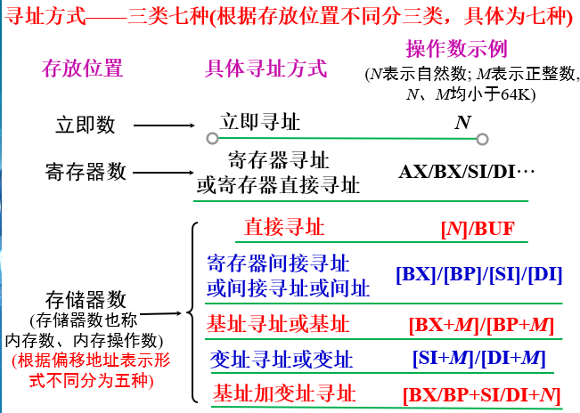

操作数是指令的操作对象，寻址方式就是在指令中，使用特定的助记符或助记符表达式(地址表达式)，告知CPU如何计算出操作数的地址，从而正确地取出操作数进行后继的指令操作. 计算出操作数地址的过程就是寻址。通俗的讲，就是通知CPU本条指令的操作数在哪儿？或者说用什么方式才能得到操作数。

在微型计算机中，操作数可能以如下四种方式存在：

1. 立即数：操作数包含在指令中，这种操作数称为**立即数** 。如 `MOV  AX, 1234H`
     - 立即数以数字开头，以Ａ～Ｆ开头的16进制数，必须前缀0。
     - 立即数的数制用后缀表示,B表示二进制数,H表示十六进制数,D或缺省为十进制数，单引号括起来的字符编译成相应的ASCII码 。
     - 可以用`+`,`–`,`*`,`/`组成立即数表达式
     - 程序员可以按自己的习惯书写立即数，各种合法的立即数经汇编后，一律自动转换成等值的二进制数，负数用补码表示。
2. 寄存器数：操作数存放在CPU的某个寄存器中，这种操作数称为**寄存器操作数**`MOV  DS, AX`
3. 存储器数：
     1. **直接地址** —— 包含在指令中的16位地址偏移量。
     2. **间接地址**—— 由CPU内部某个16位寄存器的内容决定，如 BX、BP、SI、DI。
     3. **基址**—— 基址寄存器BX或BP加上指令中包含的8位或16位位移量。
     4. **变址**—— 变址寄存器SI或DI加上指令中包含的8位或16位位移量。
     5. **基址加变址**—— 由一个基址寄存器BX或BP加上一个变址寄存器SI或DI，再加上指令中包含的8位或16位位移量。
4. 操作数存放在I/O端口中， 这种操作数称为**I/O端口操作数**``IN  AL, 60H`
5. 操作数存放在存储器中， 这种操作数称为**存储器操作数 (内存操作数)**`MOV  AX,DS:[2000H]`

直接寻址和寄存器寻址是没有对应的逻辑段的

### 寄存器寻址

- **直接寻址**
  - 表达式的格式1：段寄存器：[偏移地址]如：MOV   AL, ES:[2CH];MOV   AX, DS:[2000H]
  - 表达式的格式2： 段寄存器:变量名[^332]
- **间接寻址**的地址表达式 段寄存器：[间址寄存器] [^333]（某单元的物理地址=段寄存器内容×16+间址寄存器）
- **基址**寻址的地址表达式：段寄存器:[基址寄存器+位移量] [^334]

- **变址**:没有比例因子的变址寻址其地址表达式为： 段寄存器：[变址寄存器+位移量]
- **基址加变址**:无比例因子基址加变址地址表达式： 段寄存器：[基址寄存器+变址寄存器+位移量]
- 基址寄存器和变址寄存器都是16位或都是32位，否则(16位寻址和32位寻址混合使用)是非法指令
  - 默认的段寄存器不一致，这样的组合虽然是合法，但容易出错
  - 在不使用段超越前缀的情况下，规定：如果偏移地址中含有BP，则其缺省的段寄存器为SS；否则，其缺省的段寄存器为DS。

### 存储器操作数寻址方式

在读写内存操作数之前，CPU必须知道相关存储单元的物理地址。
由于CPU对存储器采用分段管理, 因此指令格式中只能写出存放操作数的内存单元的“逻辑地址”
 程序员的责任仅在于正确的书写逻辑地址[^331]表达式，然后由CPU自动运算以求出物理地址。
 操作系统将程序调入内存时才给段寄存器赋实际值。此时，计算出的20位地址才是实际的物理地址

#### 约定访问逻辑段 省略段基址

| 间址寄存器   | 约定访问的逻辑段 |    适用于...     |
| ------------ | ---------------- | :--------------: |
| **BP**       | **堆栈段SS**     | **16位寻址方式** |
| **BX,SI,DI** | **数据段DS**     | **16位寻址方式** |

| 基址寄存器 | 约定访问的逻辑段 |                  |
| ---------- | ---------------- | ---------------- |
| **BP**     | **堆栈段SS**     | **16位寻址方式** |
| **BX**     | **数据段DS**     | **16位寻址方式** |

| 变址寄存器  | 约定访问的逻辑段 | 适用于……                  |
| ----------- | ---------------- | ------------------------- |
| **SI,  DI** | **数据段DS**     | **无比例因子,16位  寻址** |

对于基址加变址寻址，当基址寄存器为BX时，默认段约定寄存器为DS，当基址寄存器为BP时，默认段约定寄存器为SS。

[^331]:逻辑地址形式——段寄存器:偏移地址
[^332]:用变量名代表存储单元的偏移地址汇编语言允许为某单元起一个“名字”，这个名字就称为该单元的“变量名”，经汇编之后，变量名有段基址和偏移量两种属性。变量名是唯一的，程序中不能有重复的变量名。所以，“段寄存器：”可以省略。
[^333]:访问约定的逻辑段时，省略段寄存器
[^334]:物理地址=段寄存器内容×16+基址寄存器+位移量;访问约定的逻辑段，简化的地址表达式：

## 3.4 汇编语言语法

### 一、概述

#### 1.可执行文件的生成( Microsoft Windows系统)

汇编语言程序的开发过程（来自P141 4.2.3）

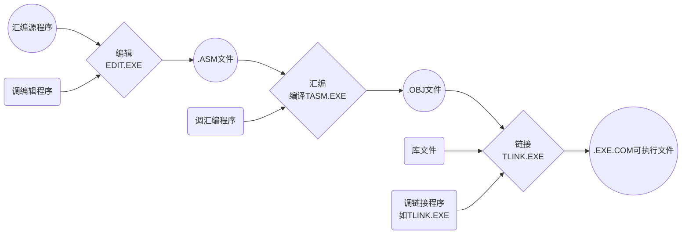

#### 2.汇编源程序中的语句类型和格式

汇编语言源程序包括的语句类型为：指令性语句和指示性语句。

- **指令性语句**:即为通常所说的符号指令（经汇编后,其目标指令通知CPU进行什么操作）。指令性语句的格式就是符号指令的书写格式
- **指示性语句**:包括宏指令和伪指令
  - **伪指令**:是非机器指令，是在汇编期间进行操作的、为汇编程序，链接程序提供汇编链接信息
  - **宏指令**:

两种汇编语言语句类型**指令性语句（符号指令）**和**指示性语句（伪指令）**对应的格式为：

| 语句对比       |        |              |      |                                      |        |
| -------------- | ------ | ------------ | ---- | ------------------------------------ | ------ |
| **指令性语句** | 标号： | 操作码助记符 | 空格 | 操作数助记符(多个操作数之间用，隔开) | ；注释 |
| **指示性语句** | 变量   | 伪指令助记符 | 空格 | 操作数项(多个操作数之间用，隔开)     | ；注释 |

1. 变量名后没有冒号
2. 不同的伪指令，操作数个数和类型不同
3. 标号名、变量名、段名、过程名…命名规则:以除数字以外的字母或符号开头,后跟字母、数字，并且长度≤31个字符

### 二、常用伪指令

#### 数据定义伪指令

##### **字节定义伪指令** `变量名 DB    一个或多个用逗号间隔的单字节数

- DB — Define Byte 的缩写,“定义字节”。
  - ?  — 随机数, Dup ~ Duplicate(重复)
  - 3 Dup(?) 代表3个用逗号间隔的随机数
  - 5 Dup ('A') 代表5个用逗号间隔的A的ASII码
  - 用DB定义的这些内存单元(N1~ N1+12,N2~ N2+2)的属性均为“字节型”。

```assembly
N1     DB   12H,64,-1,3*3;N1是变量名是一个逻辑地址，占用一个字节
       DB   01010101B,  ‘A’ , ‘B’
       DB   0A6H, ‘ HELLO’
N2     DB   ?,?,?        ;与下条等价
N2     DB    3 DUP(?)
```

##### **字定义伪指令** `变量名  DW 一个或多个用逗号间隔的双字节数`

通知汇编程序把DW后跟的双字节数,依次存入从变量名开始的单元,每一个数占2个字节,存放时满足小端法规则，即：低位字节到低址单元,高位字节到相邻的高址单元。后面都满足此规则。8086字长为16

- DW — Define Word “字定义”
- ? — 双字节随机数
- 单引号中只能是一个或两个字符
- 用DW定义的这些单元的属性都是“字型”,如上例, WNUM ~ WNUM+11这12个单元的属性都是“字型”。

```assembly
WNUM   DW   1234H,56, ‘AB’, ‘C’;变量名是指向一个单元的逻辑地址
       DW   ?,?
       DW   2 DUP(?)
```

##### **双字定义伪指令**`变量名 DD 一串用逗号间隔的4字节数`

- 用DD定义的这些单元的属性都是“双字型”，上例DNUM ~ DNUM+3单元，这些单元都是双字型单元。

##### 多字节定义伪指令

- `变量名  DF  一串用逗号间隔的6字节数`
- `变量名  DQ 一串用逗号间隔的8字节数`
- `变量名  DT  一串用逗号间隔的10字节数`

#### 符号定义伪指令

##### 等值伪指令`符号常数  EQU 表达式`

- 如:   NUM   EQU   33
- 功能: 定义符号常数NUM的值为33

##### 等号伪指令`符号常数 = 表达式`

- 如:  NUM = 33
  - 功能:定义符号常数NUM的值为33
区别:

- 用EQU定义的符号常数,其值在后继语句中不能更改
- 用“=”定义的符号常数,其值在后继语句中可以重新定义

### 三、常用运算符

1. 算术运算符`+-\*/`
2. 关系运算符`EQ(等于), NE(不等于), GT(大于),LT(小于),GE(大于或等于)`
3. `$`运算符：汇编程序对源程序是逐行汇编的,​运算符可以返回汇编计数器的当前值。
   - **应用**：$运算符紧跟在 DB、DW、DD伪指令之后,统计字符串的长度。
   - **注意**：空格也有ASCII码，为20H（32D）
4. `SEG`运算符
   - 格式: SEG 段名或变量名或标号名
   - 功能: 计算某一逻辑段的段基址
5. `OFFSET`运算符
   - 格式：OFFSET  变量名或标号名
   - 功能：算出逻辑段中某个变量或标号名所在单元相对于段首的偏移地址。
6. `PTR`运算符
   1. 格式: `<类型说明符> PTR <地址表达式>`，如`BYTE PTR　VAR1`
   2. 指令的操作数**至少有一个**类型属性要确定，否则必须用`PTR`运算符说明其中的内存操作数的类型
   3. 若两个操作数的类型属性都确定，则必须保持一致。否则必须用`PTR`运算符改变其中的内存操作数的类型，以保持前后属性一致。
7. 方括号运算符：用方括号括起来的地址表达式是访问内存操作数常用的寻址方式，方括号的另一用途是标注数组元素的下标，下标从0开始。
   | 类型属性确定的操作数         | 类型属性不确定的操作数                       |
   | ---------------------------- | -------------------------------------------- |
   | 寄存器数                     | 立即数                                       |
   | 用变量名直接寻址的内存操作数 | 间址、基址、变址、基加变址寻址的内存操作数数 |

#### `PTR`的具体应用方法

- 在双操作数指令中(例如：`MOV`，`ADD`，`SUB`等指令)
  1. 源操作数为**立即数**，目标操作数为**(变量名)直接寻址的存储器操作数**，当二者类型属性不一致时，后者必须用`PTR`临时修改其属性，使源目类型属性一致。
  2. 源操作数为**立即数**，目标操作数为**间址、变址、基址或基址加变址寻址的存储器操作数**[^3421]，*无论两者类型属性是否已经一致*，后者都必须用PTR显式说明其类型属性，使得源目操作数类型属性一致。
  3. **源操作数和目标操作数中一方为寄存器操作数**，另一方为直接寻址的存储器操作数，但二者类型属性不一致，必须用PTR临时修改其中的存储器操作数的属性。
- 在单操作数指令中(例如：INC，DEC等指令)
  1. 操作数为间址、变址、基址或基址加变址寻址的存储器操作数，必须用PTR说明是字节操作、字操作、还是双字操作，具体根据使用该条指令操作的意图。
  2. 操作数是直接寻址方式的存储器操作数，是否使用PTR要看操作数的类型属性要求是否与指令规定的操作数的类型属性一致(例如: PUSH指令)或者依据使用该条指令的操作意图。

[^3421]: 有时也叫非变量名直接寻址的的操作数

## 3.5 汇编语言基本指令集

符号约定：

- `N` 代表立即数，N8、N16、N32代表8、16、32位立即数
- `R` 代表寄存器操作数，R8、R16、R32代表8、16、32位寄存器操作数
- `M` 代表内存操作数，M8、M16、M32代表8、16、32位内存操作数
- `S` 代表段寄存器

### :point_right:总说明

1. 对于双操作数指令（如：MOV,ADD,CMP...）
   1. 源、目操作数**不可同为内存操作数**
   2. 源、目操作数**属性一致**(长度相同)
   3. 当目标操作数为非变量名直接寻址的内存操作数，而源操作数为单字节/双字节立即数，则目标操作数必须用`PTR`说明类型
2. 对于单操作数指令（如：I NC,DEC...）
若操作数为间、变、基、基+变的内存操作数，则必须用PTR说明类型

### 传送类指令

本类指令执行后，不影响状态标志

#### 通用传送

##### 数据传送

功能：源→目，源不变，不影响6种标志

1. 立即数不能直接送段寄存器   ~~ MOV DS, 3000H  ~~
2. 目标操作数不允许用立即数方式   ~~ MOV 2000H, AL~~
3. 不允许在两个存储单元间传送数据   ~~MOV[2000H],[3000H]~~
4. 不允许在两个段寄存器之间传送数据   ~~MOV DS, ES~~
5. 源、目属性要一致

```assembly
MOV   目标操作数  ，源操作数
      R / M     ，  N
      R / M / S ，  R； 目标不允许是CS
      R / M     ，  S
      R / S     ，  M； 目标不允许是CS
```

##### 符号扩展/零扩展传送指令

```assembly
MOVSX    目标寄存器，源操作数
MOVZX    目标寄存器，源操作数
          R       ，R / M
```

- 源操作数不变
- 源操作数字长要小于或等于目标寄存器字长
- MOVSX  源操作数符号位向高位扩展，再送给目标
- MOVZX  源操作数高位补零，再送给目标
- 变量名寻址的带有属性，需要考虑一致性问题

例：

```assembly
MOV        DL   ，-16    ；DL=F0H
MOVSX      BX   ，DL  ；BX=FFF0H，DL、DH不变
MOVZX      BX   ，DL ；BX=00F0H，DL、DH不变
```

##### 有效地址(偏移地址)传送

```assembly
LEA  REG, SRC
;(REG)<-(SRC) 目的操作数<-源操作数;
;(16位通用寄存器)<- (内存操作数)
```

- 该指令常用来设置一个16位的J寄存器作为地址指针；
- 该指令的执行效果与`MOV REG, OFFSET  SRC`相同。

##### 交换指令`XCHG  OPRD1, OPRD2`

在寄存器间或寄存器与存储器间交换信息(不允许使用段寄存器)

- 源操作数：  寄存器、存储器
- 目的操作数：寄存器、存储器
- 执行的操作：( OPRD1) $\leftrightarrow$(OPRD2 )

##### 查表指令`X LAT    表头变量名`

- 该指令查找数据段中的字节表，即要求数据表放在数据段，每个表元素为单字节数
- 指令执行前：EBX或BX=表头的偏移地址    AL=表元素相对于表头的地址位移量

#### 堆栈操作指令

堆栈——按照 **先进后出**的原则组织的一段内存区域
堆栈指针SP的初值决定了堆栈的大小，SP始终指向堆栈的顶部，即始终指向最后推入堆栈的信息所在的单元。堆栈段寄存器SS存放堆栈区的段基址。堆栈指令一般不影响标志位

- SP栈顶：栈区的低地址，有进栈就变小，有出栈就变大
- SS(?应该是BP吧)栈底：栈区的高地址，一般无变化

1. 堆栈段寄存器SS：存放堆栈段**段基址**
2. 堆栈指针SP：存放**栈顶**单元的偏移地址
3. 堆栈指针BP: 存放**栈底**单元的偏移地址
4. SS、SP初值由程序员赋值或DOS系统自 动赋值

#### 进栈指令

```assembly
;PUSH 源操作数
;16 / N32
;S / R16 / R32 / M16 / M32
PUSH    WORD       PTR     [BX]
PUSH    DWORD    PTR     [SI+5]
```

说明：非直接寻址的内存操作数，必须用`PTR`说明属性

#### 出栈指令

```assembly
POP 目标操作数; R16 / R32 / M16 / M32 S(CS非法)
PUSH AX
POP  BX；BX=AX
```

说明：非直接寻址的内存操作数，必须用`PTR`说明属性

### PUSHF和POPF指令

- 16位标志寄存器入栈指令    `PUSHF`
  - 功能：将16位标志寄存器 Flag 的内容压入堆栈保存。
- 16位标志寄存器出栈指令    `POPF`
  - 功能：把栈中内容弹出至16位标志寄存器 Flag。
  - 注：该指令影响标志位 O、S、Z、A、P、C

### 算术运算类指令

| 分类     | 名称           | 格式             | 功能                    | O S Z  A P C       |
| -------- | -------------- | ---------------- | ----------------------- | ------------------ |
| 加法指令 | 加法指令       | ADD  DST,SRC     | 加法（字、字节）        | O S Z  A P C       |
|          | 带进位加法指令 | ADC  DST,SRC     | 带进位加法(字、字节)    | O S Z  A P C       |
|          | 加1 指令       | INC  OPRD        | 加1（字、字节）         | O S Z  A P         |
| 减法指令 | SUB  DST,SRC   | 减法（字、字节） | O S Z  A P C            |                    |
|          | 带借位减法指令 | SBB  DST,SRC     | 带借位减法(字、字节)    | O S Z  A P C       |
|          | 减1 指令       | DEC  OPRD        | 减1（字、字节）         | O S Z  A P         |
|          | 比较指令       | CMP DST,SRC      | 比较（字、字节）        | O S Z  A P C       |
|          | 求补指令       | NEG  OPRD        | 求补码                  | O S Z  A P C       |
| 乘法指令 | 无符号数乘法   | MUL  SRC         | 不带符号数乘法(字,字节) | O                C |
|          | 带符号数乘法   | IMUL  SRC        | 带符号数乘法(字,字节)   | O                C |
| 除法指令 | 无符号数除法   | DIV  SRC         | 不带符号数除法(字,字节) | 没有定义           |
|          | 带符号数乘法   | IDIV  SRC        | 带符号数除法(字,字节)   | 没有定义           |

#### 加法类指令

1. `ADD DST,SRC``ADC DST,SRC`
   - 源操作数：通用寄存器、存储器、立即数
   - 目标操作数：通用寄存器、存储器
   - 执行的操作：$DST  \leftarrow DST +SRC$(`ADC`需要加上C标值)
   - 注：该指令影响标志位；该指令适合有符号数和无符号数的运算（带符号数判O标）
2. `INC OPRD`
   - 操作数：通用寄存器、存储器    (不能是段寄存器或立即数)
   - 执行的操作：OPRD$\leftarrow$ OPRD + 1
   - 功能： 用于在循环中修改地址指针及循环次数等。
   - 注：该指令影响标志位
     1. 该指令将操作数视为无符号数；
     2. 该指令不影响 进位标志 C

#### 减法类指令

1. `SUB  DST,  SRC`
   - 源操作数：通用寄存器、存储器、立即数
   - 目的操作数：通用寄存器、存储器
   - 执行的操作：DST$\leftarrow$DST - SRC
   - 注：
     1. 该指令影响标志位
     2. 该指令适合有符号数和无符号数的运算。
2. `SBB  DST,  SRC`
   - 源操作数：通用寄存器、存储器、立即数
   - 目的操作数：通用寄存器、存储器
   - 执行的操作：DST   DST - SRC –C
   - 注：
     1. 该指令影响标志位
     2. 该指令适合有符号数和无符号数的运算。
3. `DEC  OPRD`
   - 操作数：通用寄存器、存储器    (不能是段寄存器或立即数)
   - 执行的操作：OPRD$\leftarrow$OPRD - 1
   - 功能： 用于在循环中修改地址指针及循环次数等。
   - 注：该指令影响标志位
     1. 该指令将操作数视为无符号数；
     2. 该指令不影响 进位标志 C
4. `NEG  OPRD`
   - 操作数：通用寄存器、存储器
   - 执行的操作：求补指令，将操作数按位取反后加1，再送回操作数。
   - 注：
     1. 该指令影响标志位
5. `CMP  DST, SRC`
   - 源操作数：通用寄存器、存储器、立即数
   - 目的操作数：通用寄存器、存储器
   - 注：
     1. 该指令影响标志位
     2. 该指令同 SUB , 但其不保存运算结果；
     3. 该指令后面通常跟一条转移指令，根据标志位产生不同的程序分支。

#### 乘法指令

`MUL   SRC` —— 无符号数乘法

- 源操作数：通用寄存器、存储器(不能是立即数)
- 目的操作数：DX, AX (隐含)
- 执行的操作：**SRC的类型决定是字或字节相除**
  - 字节操作$(AH,AL)\leftarrow (AL)\times(SRC) $$
  - 字操作       $(DX,AX)\leftarrow(AX)\times(SRC)$
注：该指令影响标志位
`IMUL   SRC` —— 带符号数乘法
- 源操作数：通用寄存器、存储器(不能是立即数)
- 目的操作数：DX, AX (隐含)
- 执行的操作：
  - 字节操作  $ (AH,AL)\leftarrow(AL)\times(SRC)$
  - 字操作       $ (DX,AX)\leftarrow (AX)\times(SRC)$
注：该指令影响标志位

#### 除法指令

`DIV   SRC` —— 无符号数除法
`IDIV   SRC` —— 带符号数除法

- 源操作数：通用寄存器、存储器  (不能是立即数)
- 目的操作数：DX, AX (隐含)
- 执行的操作：
  - 字节操作
    - $(AL)\leftarrow(AX) / (SRC)$ —— 商
    - $(AH) \leftarrow (AX) / (SRC)$ —— 余数
  - 字操作
    - $(AX) \leftarrow (DX,AX) / (SRC)$ —— 商
    - $(DX)\leftarrow (DX,AX) / (SRC)$ —— 余数
注：该指令对各标志位均无定义 。

#### BCD码调整指令

- 组合BCD码：一字节中含有2位BCD码。例：69的组合BCD码为69H
- 未组合BCD码：一字节中含有1位BCD码(高4位为0)。例：69的非组合BCD码为06H，09HBCD码调整指令

|      | BCD码调整指令 |                                    |
| ---- | ------------- | ---------------------------------- |
| 加法 | DAA AAA       | 前者为组合BCD码，后者为非组合BCD码 |
| 减法 | DAS AAS       | 前者为组合BCD码，后者为非组合BCD码 |
| 乘法 | AAM           | 未组合BCD码十进制乘法调整指令      |
| 除法 | AAD           | 未组合BCD码十进制除法调整指令      |

### 转移类指令

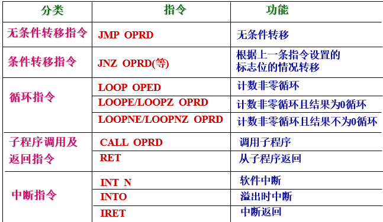

转移指令分分类

| 按照转移条件分 | 按照转移范围分 | 按照获取转移地址的方法分 |
| -------------- | -------------- | ------------------------ |
| 无条件转移     | 段内转移       | 直接转移                 |
|                | 段间转移       | 间接转移                 |

#### 无条件转移

**功能**：无条件转移，执行指定标号处的指令

| --   | 直接转移                   | 间接转移                                               |
| ---- | -------------------------- | ------------------------------------------------------ |
| 段内 | JMP 标号<br/>JMP SHORT 标号 | `JMP`寄存器操作数(不需要使用`ptr`）<br/>`JMP`内存操作数 |
| 段间 | JMP 标号                   | `JMP` 内存操作数                                       |

1. 标号是转移地址标号
2. SHORT是短转移，其转移范围相对于指令地址而言在+129~-126个单元之间

#### 有条件转移

- 一般格式:操作码助记符转移地址标号
- 应用:CMP       目，源条件转移指令
- 转移范围：转移到代码段任何位置
- 说明：操作码助记符隐含了转移的条件

##### 按标志位的当前状态转移

设转移地址标号为XYZ

```assembly
JC       XYZ            ;当前C标志为1转
JNC      XYZ            ;当前C标志为0转
JZ       XYZ            ;当前Z标志为1转
JNZ      XYZ            ; 当前Z标志为0转
JS       XYZ            ;当前S标志为1转
JNS      XYZ            ;当前S标志为0转
JP       XYZ            ;当前P标志为1转
JNP      XYZ            ;当前P标志为0转
JO       XYZ            ;当前O标志为1转
JNO      XYZ            ;当前O标志为0转
```

无符号数条件转移应用：

```assembly
CMP      N1,N2    ;N1,N2为无符号数无符号数
;条件转移设：转移地址标号为XYZ则：
JA          XYZ ;N1 > N2转
JNA         XYZ ;N1≤N2转
JC          XYZ ;N1 < N2转
JNC         XYZ ;N1 ≥  N2转转移类指令
```

有符号数条件转移应用：

```assembly
CMP   N1,N2;  N1,N2 为有符号数（机器数）有符号数
;条件转移设：转移地址标号为XYZ则：
 JG       XYZ      ；被减数的真值大于减数的真值转
 JGE      XYZ      ；被减数的真值大于等于减数的真值转
 JL       XYZ      ；被减数的真值小于减数的真值转
 JLE      XYZ      ；被减数的真值小于等于减数的真值转转移类指令
```

#### 循环控制转移

```assembly
LOOP     XYZ     ；CX-1→ CX,  结果不为零转
LOOPZ    XYZ     ；CX-1→ CX,  结果不为零,且Z标为1转
LOOPNZ   XYZ     ；CX-1→ CX,  结果不为零,且Z标为0转
JCXZ     XYZ     ；测试CX, 若CX=0转
JECXZ    XYZ     ；测试ECX, 若ECX=0转转移类指令
```

例：某班级40人，某课程考试成绩存放在SCORE开始的内存单元。请统计及格人数→OK单元。代码如下

```assembly
;数据段：
 SCORE    DB  ××, ...××；40 个成绩
 OK       DB   ?
 MOV    AX,SEG SCORE
 MOV    DS,AX
 MOV    BX,OFFSET SCORE
 MOV    CX,40
 MOV    DL,0
LAST: CMP    BYTE   PTR  [BX],60
 JC       NO
 INC     DL
NO: INC BX
 LOOP  LAST；DEC  CX    JNZ   LAST
 MOV    OK, DL
```

#### 子程序调用及返回指令

```assembly
CALL  <调用地址>
RET
```

- 调用：调用子程序，即无条件转到子程序的第一条指令
- 返回：返回断点，即返回到CALL的后继指令
- 子程序：能完成一定功能的相对独立的程序段

汇编语言的子程序定义语句

```assembly
格式
子程序名  PROC  属性
{子程序实体}
RET
子程序名    ENDP
```

说明：

- 子程序名：子程序名以字母开头，长度≤31
- 经汇编之后, 子程序名就是子程序第一条指令的地址。
- PROC/ENDP 是子程序的定界语句
- 属性  有2种描述
  - NEAR(或缺省)代表近子程序，即该子程序和调用它的那条指令在同一个代码段
  - FAR 代表远子程序，即该子程序和调用它的那条指令不在同一个代码段
- RET子程序返回指令

子过程调用和返回

- CALL指令用于调用一个子过程
  - 子过程由程序员预先设计并装入内存；
  - 子过程执行结束后要返回原调用处。

CALL调用指令的执行过程

- 保护断点；将调用指令的下一条指令的地址(断点)压入堆栈
- 获取子程序的入口地址；子过程第1条指令的偏移地址即子程序的入口地址
- 执行子过程，含相应参数的保存及恢复；
- 恢复断点，返回原程序。将断点偏移地址由堆栈弹出
| 分类     | 名称         | 指令                  | 操作数           | 举例                 |
| -------- | ------------ | --------------------- | ---------------- | -------------------- |
| 段内调用 | 直接调用     | `CALL ADDR`           | NEAR-标号        | `CALL CHANGE`        |
|          | 间接调用     | `CALL WORD PTR OPRD`  | 16位寄存器存储器 | `CALL BX`            |
| 段间调用 | 直接调用     | `CALL FAR PTR ADDR`   | FAR-标号         | `CALL FAR PTR TRAN`  |
|          | 间接调用     | `CALL DWORD PTR OPRD` | 存储器（32位）   | `CALL DWORD PTR[BX]` |
| 返回     | 返回         | `RET`                 |                  | `RET`                |
|          | 带立即数返回 | `RET EXP`             |                  | `RET 6`              |

##### 段内调用

被调用程序与调用程序在同一代码段。调用前只需保护断点的偏移地址

格式：`CALL NEAR PROC`PROC为近子程序名

执行过程：

- 将断点的偏移地址压入堆栈
- 根据过程名定位至栈子程序入口

### 逻辑与移位运算指令

| 分类         | 名称                 | 格式            | 功能                    | O S Z   A P C |
| ------------ | -------------------- | --------------- | ----------------------- | ------------- |
| 逻辑运算指令 | 逻辑与指令           | AND DST, SRC    | 与(字、字节)            | O S Z   P C   |
|              | 逻辑或指令           | OR DST, SRC     | 或(字、字节)            | O S Z   P C   |
|              | 逻辑非指令           | NOT OPRD        | 非(字、字节)            | 不影响        |
|              | 逻辑异或指令         | XOR DST, SRC    | 异或(字、字节)          | O S Z   P C   |
|              | 测试指令             | TEST DST, SRC   | 测试(字、字节)          | O S Z   P C   |
| 一般移位指令 | 逻辑左移指令         | SHL OPRD, COUNT | 逻辑左移(字、字节)      | O S Z   P C   |
|              | 算术左移指令         | SAL OPRD, COUNT | 算术左移(字、字节)      | O S Z   P C   |
|              | 逻辑右移指令         | SHR OPRD, COUNT | 逻辑右移(字、字节)      | O S Z  P   C  |
|              | 算术右移移指令       | SAR OPRD, COUNT | 算术右移(字、字节)      | O S Z  P C    |
| 循环移位指令 | 不含进位循环左移指令 | ROL OPRD, COUNT | 循环左移(字,字节)       | O        C    |
|              | 不含进位循环右移指令 | ROR OPRD, COUNT | 循环右移(字,字节)       | O        C    |
|              | 带进位循环左移指令   | RCL OPRD, COUNT | 带进位循环左移(字,字节) | O        C    |
|              | 带进位循环右移指令   | RCR OPRD, COUNT | 带进位循环右移(字,字节) | O        C    |

#### 逻辑运算指令

`AND  DST,  SRC`  —— 逻辑与(可以使特定位置0)

- 源操作数：通用寄存器、存储器、立即数
- 目的操作数：通用寄存器、存储器
- 执行的操作：$DST\leftarrow DST  \and  SRC$
- 功能： 实现两个操作数的按位与运算。(将0标记某些位置置0)
注：该指令影响标志位,使 O=0, C=0,P, S, Z反映操作的结果。

`OR  DST,  SRC`  —— 逻辑或（可使特定位置1）

- 源操作数：通用寄存器、存储器、立即数
- 目的操作数：通用寄存器、存储器
- 执行的操作：$DST \leftarrow  DST  \or SRC$
- 功能： 实现两个操作数的按位或运算。（将1标记某些位置置1）
注：该指令影响标志位使 O=0, C=0,P, S, Z反映操作的结果。

`XOR  DST,  SRC`  —— 异或(使特定位取反)

- 源操作数：通用寄存器、存储器、立即数
- 目的操作数：通用寄存器、存储器
- 执行的操作：$DST  \leftarrow DST \ XOR \ SRC$
- 功能： 实现两个操作数的按位异或运算。如果两个值不相同，则异或结果为1。如果两个值相同，异或结果为0。（用1异或取反用0异或保持不变）
注：该指令影响标志位使 O=0, C=0,P, S, Z反映操作的结果。

`TEST  DST,  SRC`  ——  测试

- 源操作数：通用寄存器、存储器、立即数
- 目的操作数：通用寄存器、存储器
- 执行的操作： DST  AND SRC
- 功能： 实现两个操作数的按位与运算，结果不保存，只影响标志位。
- 注：该指令影响标志位使 O=0, C=0,P, S, Z反映操作的结果。

TEST 通常用于检测一些条件是否满足，但又不希望改变原来操作数的情况，该指令后通常带有条件转移指令。

`NOT   OPRD`  ——  逻辑非

- 操作数：通用寄存器、存储器
- 执行的操作： $OPRD \leftarrow  NOT OPRD
- 功能： 实现操作数的按位取反运算。
- 注：该指令不影响标志位。
- 例如：  NOT  AL<br/>NOT BYTE PTR [BX]

#### 一般移位指令

|一般移位指令|示意图|
|----|-------|
|算术逻辑左移`SAL`，`SHL`|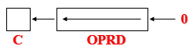|
|逻辑右移`SHR`|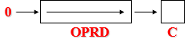|
|算术右移`SAR`|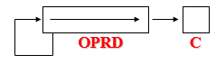|

##### 左移

`SAL  OPRD, CNT`  ——  算术左移 `SHL  OPRD, CNT`   ——  逻辑左移

- 操作数：通用寄存器、存储器
- CNT：移位次数，只能是立即数或CL寄存器
- 注：该指令影响标志位

##### 右移

`SHR  OPRD, CNT`   ——  逻辑右移（无符号数除2）

- 操作数：通用寄存器、存储器
- CNT：移位次数，只能是立即数或CL寄存器
- 注：该指令影响标志位

`SAR  OPRD, CNT`——  算术右移（有符号数除以2）

- 操作数：通用寄存器、存储器
- CNT：移位次数，只能是立即数或CL寄存器
- 注：该指令影响标志位

移位指令的作用：
    移位指令通常用来做 乘2 或 除2 的操作：左移一位        操作数×2 ;右移一位        操作数÷2

- 算术移位指令适用于带符号数的运算。
- 逻辑移位指令适用于无符号数的运算。

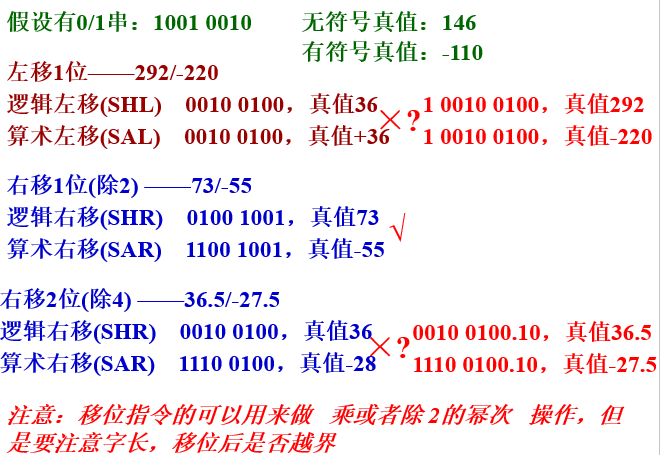

#### 循环移位指令

| 指令                  | 执行的操作                                                   |
| --------------------- | ------------------------------------------------------------ |
| 循环左移`ROL`         | 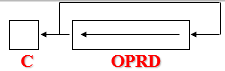         |
| 循环右移`ROR`         | 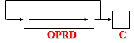         |
| 带进位的循环左移`RCL` | 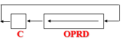 |
| 带进位的循环右移`RCR` | 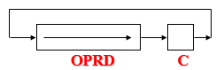 |

`ROL  OPRD, CNT`   ——  循环左移

- 操作数：通用寄存器、存储器
- CNT：移位次数，只能是立即数或CL寄存器
- 注：该指令影响标志位

`ROR  OPRD, CNT`   ——  循环右移

- 操作数：通用寄存器、存储器
- CNT：移位次数，只能是立即数或CL
- 注：该指令影响标志位

`RCL  OPRD, CNT`   ——  带进位的循环左移

- 操作数：通用寄存器、存储器
- CNT：移位次数，只能是立即数或CL寄存器
- 注：该指令影响标志位

`RCR  OPRD, CNT`  ——  带进位的循环右移

- 操作数：通用寄存器、存储器
- CNT：移位次数，只能是立即数或CL寄存器
- 注：该指令影响标志位

### 串操作指令

80X86有6条串操作指令,它们是串传送、串比较、串搜索、串装入、串存储和I/O串操作,本小节仅介绍前5条。

各种串操作指令虽然功能不同,但有许多共同之处:

- 源串和目标串的存储及寻址方式都有隐含规定,即:源串要放在数据段,目标串要放在ES附加段
- 在16位寻址操作下,CPU自动用SI间址访问数据段,用DI间址访问ES附加段、用CX做为串计数器
- 操作是如果需要将操作其他段，可以通过段重叠的方法

#### 串传送(掌握原理！)

功能：把DS:[SI]的一个元素→ ES:[DI]的若干单元

- 基本型格式：
  1. 字节串传送 `MOVSB`
  2. 字串传送          `MOVSW`
  3. 双字串传送    `MOVSD`
- 说明：
  1. 关于“元素”的概念
     - 在字节串传送指令中，一个元素就是1个字节
     - 在字串传送指令中，一个元素为2个字节
     - 在双字串传送指令中，一个元素为4个字节
  2. 指令执行前的准备工作：
     - 源串的首地址/末地址→DS:SI
     - 目串的首地址/末地址→ES:DI
     - D标志置0/置1; STD D标置1, CLD D标置0
  3. 该指令传送一个元素后，CPU自动修改SI,DI
     - 当D标志为0时，SI,DI增量修改
     - 当D标志为1时，SI,DI减量修改

#### 串装入

- `LODSB` ;DS:[SI]的1个字节→AL,自动修改SI
- `LODSW` ;DS:[SI]的2个字节→AX,自动修改SI
- `LODSD` ;DS:[SI]的4个字节→EAX,自动修改SI
准备工作：串首址/末址→DS:SI, 0/1 →D标

#### 串存储

1. 基本型格式：
   - STOSB ;AL →ES:[DI]的1个单元,自动修改DI
   - STOSW ;AX →ES:[DI]的2个单元,自动修改DI
   - STOSD ;EAX→ES:[DI]的4个单元,自动修改DI
   - 准备工作：目标区首址/末址→ES:DI,0/1 →D标
2. 有**重复前缀**的格式
   - REP    STOSB
   - REP    STOSW
   - REP    STOSD
   - 准备工作：
     - 同基本型
     - 欲存储的元素个数→CX
   - 功能：每存储一个元素，自动修改DI, 且CX-1→CX,CX=0时止

#### 串比较

串比较：比较两串字符是否相等
两串字符对应字符相等，则两串字符相等，有一个字符不等，则两串字符不等

1. 基本型格式
    - 字节串比较 ：CMPSB
    - 字串比较：CMPSW
    - 双字比较：CMPSD
    - 准备工作：
        - 源串首址/末址→DS:SI
        - 目串首址/末址→ES:DI  ,0/1 →D标
2. 有重复前缀的格式1
          REPE     CMPSB
          REPE     CMPSW
          REPE     CMPSD
3. 有重复前缀的格式2
         REPNE   CMPSB
         REPNE   CMPSW
         REPNE   CMPSD

- 准备工作：
  - 同基本型
  - 串元素的个数→ CX

#### 串搜索

在ES:[DI]的目标区，搜索是否有规定的“关键字”

1. 基本型格式
   - SCASB
   - SCASW
   - SCASD
   - 准备
     - 目标区首址/未址→ES:DI, 0/1 →D标
     - 关键字→AL/AX/EAX
   - 功能：比较AL/AX/EAX=ES:[DI]? 若ES:[DI]=关键字，则Z置1，否则Z置0，修改DI
2. 有重复前缀的格式1：
    REPE SCASB
    REPE         SCASW
    REPE SCASD
3. 有重复前缀的格式2：
    REPNE      SCASB
    REPNE      SCASW
    REPNE      SCASD

- 准备工作：同基本型
- 目标串元素的个数→ CX

|                  | **字节操作**          | **字 操  作**            | **双字操作**          |
| ---------------- | --------------------- | ------------------------ | --------------------- |
| D标志=0 为增址型 | SI+1→SI <br/>DI+1→DI   | SI+2→SI<br/> DI+2→DI      | SI+4→SI <br/>DI+4→DI   |
| D标志=1 为减址型 | SI-1→SI<br/>   DI-1→DI | SI-2→SI   <br/>   DI-2→DI | SI-4→SI <br/>  DI-4→DI |

#### 处理及控制指令

##### 标志处理指令

| 名称                | 格式 | 功能(对标志位的影响) |
| ------------------- | ---- | -------------------- |
| 进位标志清  0  指令 | CLC  | C = 0                |
| 进位标志置  1  指令 | STC  | C = 1                |
| 进位标志取反        | CMC  | C= C                 |
| 方向标志清  0  指令 | CLD  | D = 0                |
| 方向标志置  1  指令 | STD  | D = 1                |
| 中断标志清  0  指令 | CLI  | I = 0                |
| 中断标志置  1  指令 | STI  | I = 1                |

##### 其他处理指令

| 名称                     | 格式 | 功能                     | 状态标志位 |
| ------------------------ | ---- | ------------------------ | ---------- |
| 处理器等待指令           | WAIT | 处理器等待               | 不影响     |
| 处理器交权指令(换码指令) | ESC  | 处理器交权               | 不影响     |
| 总线封锁前缀             | LOCK | 封锁总线                 | 不影响     |
| 处理器暂停指令           | HLT  | 使处理器暂时处于停机状态 | 不影响     |
| 空操作指令               | NOP  | 使CPU不进行任何操作      | 不影响     |

例：串操作指令中，源串要放在 `数据` 段，在16位寻址操作下，CPU自动用寄存器   `SI`  间址访问该逻辑段，为了使执行串操作指令时地址按减量方式处理应使用指令   `STD`   。

### 附录

此外还有[I/O指令](7_输入输出系统.md###最常用的I/O指令)
中断相关指令

- 开关中断`CLI``STI`
- 中断返回`IRET`

IRET和RET的区别如下：

- IRET从栈顶弹出6 个元素→ IP,CS,F
- 远程RET,从栈顶弹出4个元素→ IP,CS
- 近程RET,从栈顶弹出2个元素→ IP