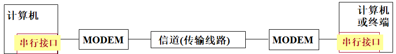
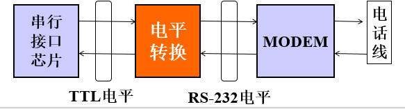
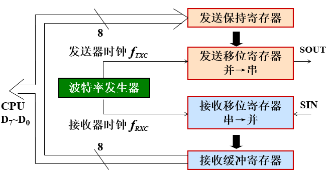
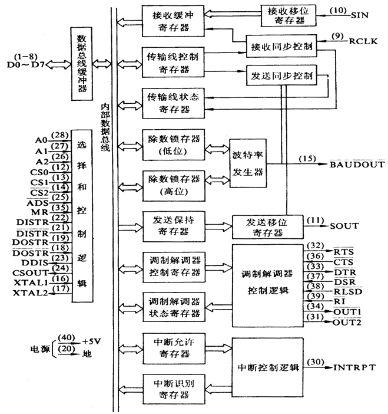
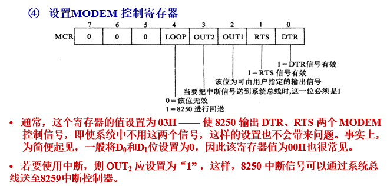
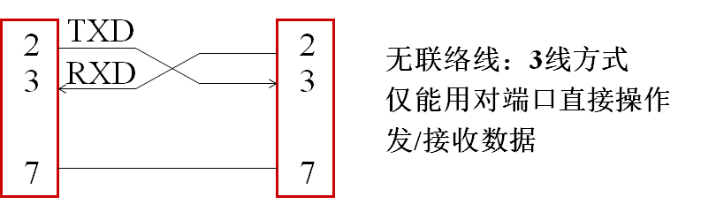
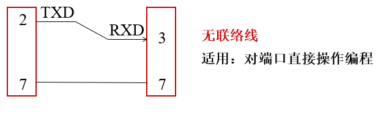
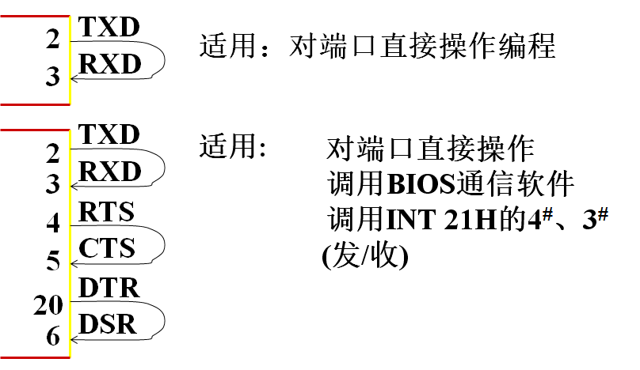

# 第九章 串口通信

## 9.1 串行通信基础

### 一、计算机通信方式

CPU与外部的信息交换称为通信

- 并行通信：数据所有位同时被传输
- 串行通信：数据被逐位顺序传送
  - 串行异步通信：指一帧字符用起始位和停止位来完成
  - 串行同步通信：靠同步字符来完成收发双方同步

#### 数据传送速度

并行通信>串行同步通信>串行异步通信
*同步通信指的是发送端与接收端的时钟同步*

### 二、串行数据传输方式

（远程）串行数据通信系统模型


对一个通信系统来讲，必须要考虑的问题有以下几个方面：

1. 信道的带宽和数据的传输速率
2. 信号的调制与解调
3. 串行通信的信号格式 等

数据的传输方式

1. 单工方式:只允许数据按照一个固定的方向传送
2. 半双工方式：要求收发双方均具备接受和发送数据的能力，由于只有一条信道，数据不能同时在两个方向上传送
3. 全双工方式：在全双工方式中，收发双方可同时进行数据传送（至少两根线）

### 串行异步通信协议

#### 标准数据格式

|起始位|数据位|奇偶校验位|停止位|
|-----|-----|-----|----|
|1位|5~8位|0~1位|1、1.5、2 位|
|逻辑‘0’|0,1代码|0或1|逻辑‘1’|
**注**：

- 数据位**先发低字节**
- 奇偶校验位（可有可无）：通信双方约定采用一致的奇偶校验方式，由发送方设置校验位，由接受方负责校验
  - 奇校验：数据位与校验位中'1'的个数为奇数
  - 偶校验：数据位与校验位中'1'的个数为偶数

#### 一帧数据发送时序

异步通信时，
一帧字符以**起始位**'0'开始，紧跟着是**数据位**(先发数据最低位，再是高位)**奇偶校验位**，最后以**停止位**结束(停止位可以是1位、1.5位或者2位的逻辑1信号)。无数据传送时，通信线长时间逻辑'1'。

#### 通信速率(传输速率)

通信速率，又称波特率，表示每秒钟传送的0、1代码个数(包括起始位、校验位、停止位)，单位为“波特”。
(bite  per  second—— bps)——  [^波特率]
[^波特率]:注：本书中的信号传输是使用二进制信号进行的，此处的波特率(数据信号速率)也指比特率(数据通信速率)。
异步通信传送中，收发双方必须约定：

- 收发双方的**通信速率**必须一致
- 收发双方的**数据帧格式**必须一致

#### 信号的调制与解调（了解）

- 调制：用一个信号控制另一个信号的某个参数随之变化的过程，叫调制。
<br/>这两个信号分别叫调制信号和被调信号，被调信号只作为传输过程中信息的载体，也叫载波。
- 解调： 将已经调制的信号恢复成原来的数字信号的过程。

通常情况下，通信是双向的，调制器和解调器设置在同一个装置中，称为调制解调器(MODEM,猫，ADSL )。这个设备在远距离通信中具有重要作用！

#### RS232C标准——串行通信接口标准

> 要进行串行通信，还要解决一个问题：计算机与MODEM怎样连接？         —— 通过接口电路——串行接口电路  连接。
> 这个接口其： 机械特性、电气特性、功能特性 都要遵循一定的规范，也就是要有一个标准。

目前计算机通信使用最普遍的是RS-232C标准。它对两方面作了规定：信号的电平标准和控制信号的定义。


1. 控制信号的定义(机械特性)早期的PC系列机一般有两个串行口：即COM1和COM2，使用9针和25针两种连接器，符合RS-232C接口标准。
RS-232C使用25芯连接器和9芯连接器

##### 25针连接器中通信中常用的9个端子

| 25针连接器端子号 | 名称   | 方向(从微机出发) | 功能                            |
| ---------------- | ------ | ---------------- | ------------------------------- |
| *2*              | TXD    | 输出(DTE→DCE)    | 发送数据(Transmit Data)         |
| *3*              | RXD    | 输入(DCE→DTE)    | 接收数据(Receive Data)          |
| 4                | RTS    | 输出(DTE→DCE)    | 请求发送(Request To Send)       |
| 5                | CTS    | 输入(DCE→DTE)    | 允许发送(Clear To Send)         |
| 6                | DSR    | 输入(DCE→DTE)    | 数据设备准备好(Data Set Ready)  |
| *7*              | GND/SG |                  | 信号地(Signal  Ground)          |
| 8                | DCD    | 输入(DCE→DTE)    | 载波检测(Carrier DeteCt)        |
| 20               | DTR    | 输出(DTE→DCE)    | 数据终端准备好(Data Term Ready) |
| 22               | RI     | 输入(DCE→DTE)    | 振铃指示(Ring Indicator)        |

##### 信号电平标准（电器特性）

标准规定：

- 逻辑“1”信号，电平在 –3V ~ -15V 之间；
- 逻辑“0”信号，电平在 +3V ~ +15V 之间；
因此，使用RS-232C与微机接口时，需要将TTL电平[^TTL] (0 ~ 5V)与RS-232C电平进行转换。



[^TTL]:注：计算机处理器中数据表示采用二进制规定，+5V等价于逻辑“1”，0V等价于逻辑“0”，这被称做TTL(晶体管-晶体管逻辑电平)信号系统，这是计算机处理器控制的设备内部各部分之间通信的标准技术。

## 9.2 可编程串行异步通信接口芯片8250

详细见：[可编程串行异步通信接口芯片8250](图片.assets/可编程串行异步通信接口芯片8250.md)

- 能实现数据串$\Leftrightarrow$并变换，实现全双工异步通信支
- 持异步通信协议，数据格式、通信速率等由初始化编程设定
- 内部有MODEM控制器，可直接和MODEM相连
- 内部有中断机制，CPU可用查询、中断方式与之交换信息
- 以Ins 8250为核心器件的微机串行口，基于RS-232C标准，微机之间既通过连接调制解调器实现通过电话线路的远距离通信，也可以
- 直接连接进行短距离的点到点通信。

 PC机有2个串行口，端口I/O地址分别为主串口`3FXH`、辅串口`2FXH`（高档微机中，8250的功能被一些多功能芯片取代）



- **串行数据发送过程：**CPU执行OUT指令，将待发送的数据→发送保持寄存器暂存，当发送移位寄存器空闲时自动装入，后者在发送器时钟控制下将并行数据添加起始位、校验位、停止位，一位一位发出。

- **串行数据接收过程：**在接收器时钟控制下，接收移位寄存器一位一位地接收串行数据，自动的去掉起始位、校验位、停止位，并转换成并行数据→接收缓冲寄存器暂存，在接收过程中对一帧数据自动进行校验。

### 内部结构



*TIP*:寄存器不一定有口地址，口地址一样的寄存器不一定是同一个寄存器，口地址相同不会同时访问两个寄存器

1. **发送保持寄存器**(3F8H/2F8H)
   该寄存器保存CPU传送来的并行数据，并转移至发送移位寄存器
   注：只有在发送保持寄存器空闲时，CPU才能写入下一个数据。
2. **接收缓冲寄存器**(3F8H/2F8H)
   接收移位寄存器，去掉起始位，校验位和停止位，转换成并行数据，转换后的并行数据存入接收缓冲寄存器，等待CPU接收。
   注：只有当一帧数据收完后，CPU才能用IN指令读接收缓冲寄存器

3. **通信线状态寄存器**(3FDH/2FDH)：D0与D5最重要，D1到D5之间的是

- **D0位**：接收数据准备好(接收缓冲器满)标志位。 D0＝1，表示接收器已接收到一帧完整的数据，并已转换成并行数据，存入接收缓冲寄存器。(CPU接收数据时一定要查询)
- **D5位**：***发送保持寄存器***空闲标志位。D5＝1，表示数据已从发送保持寄存器转移到发送移位寄存器，发送保持寄存器空闲，CPU可以写入新数据。当新数据送入发送保持寄存器后， D5置0。
- D7位：恒为0。

 注意：D0位(接收数据准备好)和D5位(发送保持寄存器空)是串行接口最基本的标志位，它们决定了CPU能不能向8250进行读写操作，只有当D0＝1时，CPU才能读数；只有当D5=1或D6=1时，CPU才能写数据。
4. 中断允许寄存器（3F9H/2F9H)
5. 中断识别寄存器（3FAH/2FAH)
6. MODEM控制寄存器（3FCH/2FCH）
7. 除数寄存器( 高8位3F9H/2F9H ，低8位3F8H/2F8H )
8. 通信线控制寄存器（3FBH/2FBH）
9. MODEM状态寄存器（3FEH/2FEH）

## 9.3 8250初始化编程

- 直接对8250端口操作
- 利用BIOS通信软件(INT 14H)*（了解）*

直接对8250端口进行 初始化编程 步骤：

1. 确定波特率 ——  设置除数锁存器`3FBH` ；**9行**
2. 确定数据格式 —— 设置通信线路控制寄存器；**3行**
3. 确定是否使用中断方式 —— 若使用，需设置中断允许寄存器的相应位置“1”，否则对应位置“0”；**3行**

4. 设置MODEM 控制寄存器   **3行**



*子程序一定要有ret*

```assembly
I8250    PROC
;除数锁存器（分频系数）
MOV       DX，3FBH;
MOV       AL，80H
OUT        DX，AL;通讯线路控制寄存器最高位置“1”
MOV       DX，3F9H;D7设置
MOV       AL，0
OUT        DX，AL;除数低位送入 除数锁存器 LSB (低8位)
MOV       DX，3F8H
MOV       AL，60H
OUT        DX，AL;除数高位送入 除数锁存器 MSB (高8位)

MOV       DX，3FBH;定义数据帧格式
MOV       AL，03H
OUT        DX，AL
MOV       DX，3F9H;中断允许寄存器
MOV       AL，0
OUT        DX，AL
MOV       DX，3FCH;MODERM控制寄存器
MOV       AL，10H
OUT        DX，AL
RET
I8250  ENDP
```

## 9.4 串行通信的外部环境

1. 短距离（无MODEM）点——点全双工通信
2. 短距离单工通信
3. 外环自发/自收

## 9.5 串行通信程序设计举例

设计时需要考虑：

① 题型：单端自发自收，点—点通信(全双工、单工)

② CPU与串口交换信息的方式：查询？中断？

③ 编程手段：对端口直接编程？调用BIOS通信软件

④ 根据题目要求组织相应的外部环境

1. 对端口直接操作发送和接收数据，
    程序中查询联络线,可以按“有联络线”方式接线
    程序中不查询联络线，可以按“无联络线”方式接线

2. BIOS通信软件是一个全双工的通信软件，发送和接收之前都要使用联络线与对端“握手”，只有联络畅通，才能发送或接收数据！

3. 当8250设置为内环自检方式的时候，只能采用查询方式，而且只能采用对端口直接操作的编程手段，完成数据的发送和接收。
