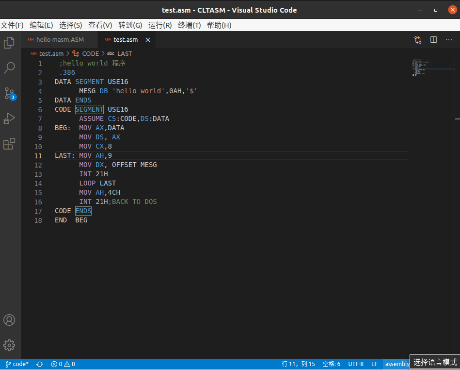

# vscode汇编插件

[](https://marketplace.visualstudio.com/items?itemName=xsro.masm-tasm)
[](https://marketplace.visualstudio.com/items?itemName=xsro.masm-tasm)
[](https://marketplace.visualstudio.com/items?itemName=xsro.masm-tasm)
[](https://marketplace.visualstudio.com/items?itemName=xsro.masm-tasm)
[](https://dev.azure.com/clcxsr/masm-tasm/_build/latest?definitionId=1&branchName=next)

[](https://github.com/xsro/masm-tasm/issues)
[](https://github.com/xsro/masm-tasm)


在VSCode中调用DOSBox（或msdos-player）来实现简单的x86（MASM/TASM）汇编操作

- 学习微机原理时整理的部分笔记[pages](https://xsro.gitee.io/cltasm/#/)
- 学习微机时整理的部分汇编代码[cltasm](https://gitee.com/dosasm/CLTASM)

## 安装使用方法

- 首先下载VSCode，前往官网直接点击`DOWBLOAD`下载对应版本即可，[VSCode](https://code.visualstudio.com)
- 下载完成之后可以先安装对应的语言插件，如中文插件，在拓展商店里搜索`chinese`即可找到中文本地化插件
- 下载安装本插件，在拓展商店中搜索`MASM/TASM`即可找到，安装即可
- 使用vscode打开一个文件夹（或者在电脑自己喜欢的位置新建一个文件夹，然后用VSCode打开）
- 新建一个汇编代码文件，以`.ASM`为后缀名保存
- 右键选择`run ASM code`(运行当前程序(汇编+链接+运行))：一键汇编链接运行代码

## 编译运行代码

比如如下的简单Hello Word代码，保存为`test.asm`

```assembly
 ;hello world 程序
 .386
DATA SEGMENT USE16
      MESG DB 'hello tasm',0AH,'$'
DATA ENDS
CODE SEGMENT USE16
      ASSUME CS:CODE,DS:DATA
BEG:  MOV AX,DATA
      MOV DS, AX
      MOV CX,8
LAST: MOV AH,9
      MOV DX, OFFSET MESG
      INT 21H
      LOOP LAST
      MOV AH,4CH
      INT 21H;BACK TO DOS
CODE ENDS
END  BEG
```

编辑完成之后在编辑器右击即可运行程序。（示例使用jsdos来模拟）。这里我们先使用`打开DOS环境`手动打开模拟器。在里面输入如下命令

```cmd
::DOSBox中命令文件不区分大小写
::汇编ASM源代码生成OBJ文件
masm test.asm
::链接OBJ文件为二进制可执行文件
link test.obj
::运行生成的文件
test.exe
```

效果如下，其中`dir`命令为DOSBox自带命令，表示查看当前目录下的文件



<details>
<summary>不那么重要的信息</summary>

- 由于DOS系统的文件系统有时会不支持现在电脑的文件路径，所以插件有时会对文件进行复制操作，将文件复制挂载到可以操作的文件目录，通常在打开的模拟器中是以T.ASM的形式呈现。也就是说此时的T.ASM文件是编辑器文件的副本。
- 也可以使用通过设置中的`masmtasm.ASM.emulator`选项，设置使用dosbox（目前来看应该是最稳定的DOS模拟器，很多都是基于它的），通过`masmtasm.ASM.MASMorTASM`可以使用TASM汇编工具
- [常见汇编命令](../references/ASM_commands.md)
- [DOSBox自建命令](https://www.dosbox.com/wiki/Commands)，也可以在JSDos中使用

</details>

插件还提供了，运行代码和调试代码两个命令，他们可以说就是自动向DOS模拟器中注入命令，这些命令不一定就是想要的，具体参考插件设置页。
