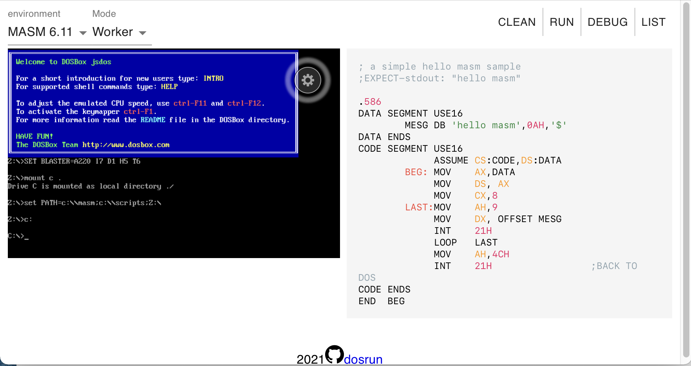

# DosRun PlayGround

[](https://github.com/dosasm/dosrun/actions/workflows/gh-pages.yml)

Playground布置在如下地址中，点击链接即可进入。
网站借助[JsDos](https://js-dos.com)实现一个模拟的DOS环境，可以用该网站进行编程练习，或仅仅用来回忆DOS那个时代。

- github pages: <https://dosasm.github.io/dosrun>
- gitee pages: <https://dosasm.gitee.io/dosrun>

当然，主要是针对汇编语言，做了一点小小的适配。

## 页面布局

其实也没啥复杂的，打开网站，网页由四部分组成：

- 左上角可以修改DOSBox基础环境（通过jsdos [bundle](#基础环境)）如汇编、C环境。
- 右上角是操作DOSBox执行任务的按钮
- 下面分别是DOSBox窗口和编辑器窗口



## 使用方法

1. 在右侧编辑器写代码，通常会自动加载示例代码
2. 点击按钮，执行响应操作
   - **代码内容**和**需要自动执行的DOS命令**会被写入到jsdos bundle中
   - 使用jsdos加载dosbox模拟器，运行命令
   - 呈现效果
3. 如果需要手操操作，如执行DOS命令，可以在dosbox窗口中操作

## 注意事项

我不是react专业选手，设计不足之处，望多指点。目前的交互很草率。

1. 目前只能操作单个文件
2. 每次点击按钮（除clean按钮），DOS模拟环境就会重启，所有更改都会消失，所以需要谨慎

尽管如此，如果要求不高的话，只要求能够编译简单的单文件C语言和MASM的话还是可以使用的。当然如果需要更好的性能，欢迎issue和PR。

## 参数设置

在url中可以传递参数

|参数|值类型|description|
|---|---|---|
|env|string|基础dosbox环境，如`empty`,`MASM 6.00`|
|code|string|编辑器中需要呈现的代码，如`echo hello`|
|exec|string|需要执行的命令,记按钮对应的命令，如`run`，`debug`|

环境和命令需要已经在[配置文件](#配置文件)中，使用参数的例子如下

```
https://dosasm.gitee.io/dosrun?code=echo+hello&env=batch&exec=run
```

## 配置文件

按钮执行的操作和环境定义在配置文件[bundle.config.json](https://github.com/dosasm/dosrun/blob/main/react-app/src/bundle.config.json)中，并且被我写死了，要修改配置目前只能修改代码，重新部署。

## 基础环境

[jsdos bundle](https://js-dos.com/v7/build/docs/jsdos-bundle)是`jsdos v7`用来模拟DOS环境的打包文件，以zip格式存储。
本webapp使用该文件设置基础环境，包含进行编程的主要文件和程序，
具体文件可以查看[bundles/src文件夹](https://github.com/dosasm/dosrun/tree/main/bundles/src)

