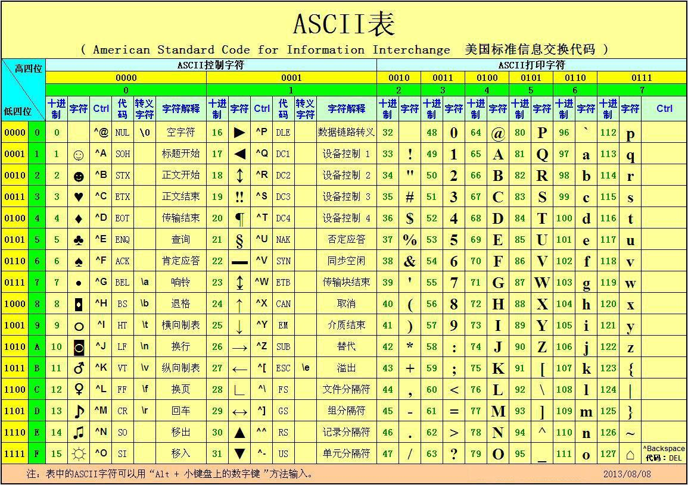

# 第1章 微型计算机基础

[toc]

## 1.1计算机中的**数制**(进制)

| 4位二进制数 | 等值十六进制数 | 4位二进制数 | 等值十六进制数 |
| :---------: | :------------: | :---------: | :------------: |
|    0000     |       0        |    1000     |       8        |
|    0001     |       1        |    1001     |       9        |
|    0010     |       2        |    1010     |       A        |
|    0011     |       3        |    1011     |       B        |
|    0100     |       4        |    1100     |       C        |
|    0101     |       5        |    1101     |       D        |
|    0110     |       6        |    1110     |       E        |
|    0111     |       7        |    1111     |       F        |

## 1.2编**码制**度

计算机中主要通过BCD码来存储数字，使用ASCII码来存储字符（ASCII码有7位，通常使用一个字节（八位）表示）

|常见字符|十进制ASCII码|十六进制ASCII码|常见字符|十进制ASCII码|十六进制ASCII码|
|-------|------------|---------------|-------|------------|---------------|
|'\r'|13|0DH|'\n'|10|0AH|
|'0'|48|30H|'9'|57|39H|
|'A'|65|41H|'Z'|90|5AH|
|'a'|97|61H|'z'|122|7AH|

### 真值与机器数

1. **真值**：一个数的数值。
2. **机器数**：把符号数值化，用0表示“+”，用1表示“-”，这样，连同符号位在一起作为一个数，称为机器数。
   1. **原码**：表示的有符号数，最高位为符号位，数值位部分就是该数的绝对值
   2. **反码**：表示的有符号数，也是把最高位规定为符号位，但数值部分*对于正数是其绝对值*，而**对于负数则是其绝对值按位取反(即1变0，0变1)**。
   3. **补码**：表示的有符号数，*对于正数来说同原码、反码一样*，但**负数的数值位部分为其绝对值按位取反后末位加1所得**。
3. **字长**：包括符号位在内，一个二进制数占有的位数如：字长n=8的二进制数，除了符号位，数值部分为7位

**补码机器数的数值范围**
设机器数字长为n位,用来表示整数,则n位补码数,其真值范围为$-2^{n-1} ～ +2^{n-1} - 1$

以模8为例，假如是有符号数，可以表示的真值范围是$-2^7\sim 2^7-1$

|真值|原码|反码|补码|
|----|---|----|---|
|127|0111 1111|0111 1111|0111 1111|
|1|0000 0001|0000 0001|0000 0001|
|0|0000 0000|0000 0000|0000 0000|
|-1|1000 0001|1111 1110|1111 1111|
|-128|1000 0000|1111 1111|1000 0000|

-128的原码和反码似乎有点问题

### 整数补码的运算

**模的概念**：一个计量器的最大容量称为该计量器的“模”

|n位计量器|存储数据范围|模|
|----|----|-----|
|四|0000~1111|16|
|八|0000,0000~11111,1111|256|
|十六|~|65536|
 整数补码的加减运算
$$
[ｘ＋ｙ]_补＝[ｘ]_补＋[ｙ]_补\\
[ｘ－ｙ]补＝[ｘ]_补＋[－ｙ]_补\\
$$
条件：

1. 符号位参加运算
2. 以$2^n$为模(*n*为字长)
3. 当真值满足$－2^{n-1}\leq x, y, x\pm y < +2^{n-1} $时，结果是正确的，否则结果错误，可以通过标志位信息判断是否正确

### 无符号数的概念

### 溢出与进位的概念

- **进位**：运算后，最高位向更高位的进位值。
- **溢出**：运算结果超出了运算器所能表示的范围。

1. 运算器对有符号数和无符号数同样对待
2. 最高位的进位值保存在“进位标志寄存器”中
3. 如**加数与被加数的最高位相同，却与结果的最高位相异**，则将溢出标志置为1

判断规则：

- 如果参与运算的数是无符号数，则判进位标志CF，进位标志=1，表示溢出错。
- 如果参与运算的数是有符号数，则判溢出标志OF，溢出标志=1，表示溢出错。

## 1.3计算机的基本**组成**

### 微型计算机的分类

- 单板机
- 多板机
- 个人计算机PC
- 嵌入式计算机、嵌入式系统Embedded System)、嵌入式系统的核心部件是嵌入式处理器包括四类
  - 嵌入式微控制器(MicroController Unit,MCU)，又称微控制器，单片机
  - 嵌入式微处理器(Micro-Processing Unit,MPU)
  - 嵌入式数字信号处理器(Digital Signal Processor,DSP)
  - 嵌入式片上系统(System on Clip,SoC)

### 计算机系统组成

- 硬件：泛指设备而言（中央处理器CPU、 (运算器、控制器)、存储器系统 、I/O接口、电源系统、I/O设备 ）
  - CPU[^131]: 即微处理器，是超大规模集成电路，内部集成了运算器、控制器、存储器管理部件
  - 存储器: 指系统的主存储器，简称为内存。用来存放程序、数据
  - I/O接口: 是CPU和外部设备交换信息的“中转站”
  - I/O设备: 如键盘、显示器、打印机（注意：硬盘(外存储器)也是I/O设备！）

- 软件：泛指程序而言（系统软件、应用软件）

  [^131]:中央处理器（Central Processing Unit），简称CPU，是1971年推出的一个计算机的运算核心和控制核心，是信息处理、程序运行的最终执行单元。CPU包含运算逻辑部件、寄存器部件和控制部件等，并具有处理指令、执行操作、控制时间、处理数据等功能。其自产生以来，在逻辑结构、运行效率以及功能外延上取得了巨大发展。

### 计算机的发展

- 第一代(1946～1957)——采用电子管作为逻辑部件
- 第二代(1957～1965)——采用晶体管作为逻辑部件
- 第三代(1965～1971)——采用中、小规模集成电路为主要部件
- 第四代(1971～现在)——采用大、超大规模集成电路为主要部件

#### 微型计算机的发展

| 时间       | 代                                   | 代表型号                                                     |
| ---------- | ------------------------------------ | ------------------------------------------------------------ |
| 1971       | 第一代微处理器(4、8位)               | Intel的4004（1971）、4040（4位）、8008（8位）                |
| 1973-1977  | 第二代微处理器                       | Intel的8080/8085、Zilog的Z80、Motorola的6800/6802和Rockwell的6502 |
| 1977年左右 | 超大规模规模集成电路为处理器（16位） | Intel的8086/8088、Zilog的Z8000、Motorola的M680000            |
| 1980年以后 | 16位                                 | Intel 80286、Motorola 65010                                  |
| 1983年以后 | 32位处理器                           | Intel 80386、Motorola 68020                                  |
| 1989-1995  |                                      | Intel 80486、Pentium...                                      |
| 2001       | 首个64位处理器                       | Itanium...                                                   |

### 微型机的硬件结构

- 以CPU为核心通过3条总线连接存储器、I/O接口
- 总线:总线是CPU与存储器、I/O接口交换信息的公共通道。
  - AB地址总线： 传输CPU访问存储器，**访问**I/O端口的地址信号。
  - DB数据总线：传输CPU读/写内存，**读写**I/O端口时的数据。
  - CB控制总线：CPU**发出**的控制命令， 或外部向CPU**提出**的请求。

地址总线通常是单向总线，数据总线通常是双向总线， 大部分控制线是单向，少数是双向。
