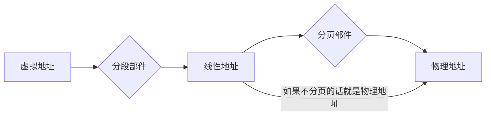

# 第二章 80x86微处理器

## 计算机常用术语

- 位与字节
- 字长（数据宽度）
- 寻址能力
- 主频，也叫时钟频率，用来表示微处理器的运行速度
- MIPS（Millions of Instruction Per Second)，用来表示为初期的性能--运算速度
- 微处理器集成度，指微处理器芯片上集成的晶体管的密度

## 微处理器的基本功能模块

- 总线接口单元BIU（取指令）（寄存器组）
- 执行单元EU（执行指令）（运算器和控制器、寄存器组）

微处理器的功能拓展模块

- 存储管理(分段和分页部件)
- 指令和数据流水线
- 指令和数据CACHE
- 指令预取
- 浮点处理
- 分支预测
- 并行计算
  等等

### Pentium采用了多项先进技术

- **CISC和RISC相结合的技术**
  - RISC（Reduced Instruction Set Computer），精简指令系统的计算机
    提供数目较少、格式与功能简单、运行高效的指令
    追求的是计算机控制器实现简单，运行高速，更容易在单块超大规模集成电路的芯片内制做出来
  - CISC（Complex Instruction Set Computer），复杂指令系统的计算机，相对于RISC一词而提出来的一种说法
    **特点**：指令条数多，格式多样，寻址方式复杂，每条指令的功能强。汇编程序设计容易些，但计算机控制器的实现困难多，很多指令被使用的机会并不多
- **超标量流水线技术**
  - **流水线**是一种使多条指令重叠操作的技术, 是当代微处理器设计中的关键技术之一。
把一条指令分解成若干个步骤来完成，在流水线上称为级，每级 都在一个时钟周期内完成各自的操作。这样每个时钟周期都可以启动 一条指令，m级的流水线上就会有m条指令在同时执行。
流水线的性能比非流水线作业几乎提高了m倍。
  - **超标量流水线**
 标量指单个量，一般的流水计算机因只有一条指令流水线，所以称为标量流水计算机，所谓超标量是指其具有两条以上的指令流水线
- **分支预测技术**
指当遇到转移指令、CALL调用指令、RET返回指令、INT n中断指令等跳转指令时，指令预取单元能够较准确地判 定是否转移取址。

## 2.1 32位微处理器内部结构

486内部寄存器分为4类：（应用程序只能访问基本结构寄存器和浮点寄存器）

- 基本结构寄存器
- 浮点寄存器
- 系统级寄存器
- 调试测试寄存器

### 基本结构寄存器

#### 通用寄存器

| 32位名称 | 16位名称[^211] | **名称**           |                            |
| -------- | -------- | ------------------ | -------------------------- |
| EAX  | AX   | 累加器         | AX (accumulater)       |
| EBX  | BX   | 基址寄存器     | BX (Base)        |
| ECX  | CX   | 计数器         | CX (Count)       |
| EDX  | DX   | 数据寄存器     | DX (Data)        |
| ESP  | SP   | 堆栈指针       | SP (Stack Pointer) |
| EBP  | BP   | 基址指针       | BP (Base Pointer) |
| EDI  | DI   | 目的变址寄存器 | DI (Destination Index) |
| ESI  | SI   | 源变址寄存器   | SI (Source Index) |
|EIP| IP |指令指针| IP (Instruction Pointer） |

[^211]: AX,BX,CX,DX,前8位称为AH,BH,CH,DH, 后8位称为AL,BL,CL,DL；

- AX、BX、CX、DX共同点
  - 既可作为16位寄存器来用又可作为两个8位寄存器（高、低位）来用；
  - 都是用于暂存操作数，或是运算的中间结果或其它一些信息
- SP、BP、SI、DI、IP：为寻址存贮单元提供偏移地址。

#### 段寄存器

CS代码、DS数据、ES附加、SS堆栈------4个段寄存器，和偏移地址寄存器一起形成20位存储器物理地址，对存储器中存放的程序、数据、堆栈区域加以区别、寻址。

- 寻址程序(指令)：CS＋IP；
- 寻址数据：(DS或ES)＋(SI或DI、BX、BP)；
- 寻址堆栈：SS＋(SP或BP)

#### :star:标志寄存器

标志寄存器FLAGS又称为程序状态字PSW，为16位寄存器，该寄存器主要有两个作用：
记录CPU运行结果状态标志；
提供控制标志。

根据功能，8086的标志可以分为两类：

- 状态标志：表示前面的操作执行后，算术逻辑部件处在怎样一种状态，这种状态会像某种先决条件一样影响后面的操作。有SF、ZF、PF、CF、AF和OF。
- 控制标志：每个控制标志都对某一种特定的功能起控制作用。指令系统中有专门的指令用于控制标志的设置和清除。有DF、 IF、 TF。

状态标志

| 状态标志符号  | 符号名称             | 标志为1的条件，否则为0                                  |
| ------------- | -------------------- | ------------------------------------------------------- |
| C进位标志     | Carry Flag           | 当**结果最高位**产生一个进位或借位                      |
| O溢出标志     | Overflow Flag        | **加数与被加数**最高位相同并且与**结果****不同**        |
| S符号标志     | Sign Flag            | **结果最高位**为1                                       |
| Z零标志       | Zero Flag            | **运算结果**为0                                         |
| P奇偶标志     | Parity Flag          | **结果低八位**中‘1’的个数为偶数（类似于奇效验）                     |
| A辅助进位标志 | Auxitiary Carry Flag | 操作时，由**低半字节（第3位）**向高半字节，有进位或借位 |

程序员判断溢出的方法

- 有符号数运算，判O标志，O标志为1，有溢出
- 无符号数矫健，判C标志，C标志为1，有溢出

## 2.2 32位微处理器的工作模式和地址空间

### 一. 32位微处理器工作模式

- 实地址模式(实模式)
- 保护虚拟地址模式(保护模式)
- 虚拟86模式

1. 实模式的特点
   1. 加电、复位之后，486自动工作在实模式，系统在DOS管理下
   2. 在实模式下，486只能访问第一个1M内存(00000H~FFFFFH)
   3. 存储管理部件对存储器只进行分段管理，没有分页功能，每一逻辑段的最大容量为64K。
   4. 在实模式下，段寄存器中存放段基址。
2. 保护模式的特点:(仅作了解）
    486工作在保护模式下，才能真正发挥它的设计能力。
   1. 在保护模式下，486支持多任务操作系统
   2. 在保护模式下，486可以访问4G物理存储空间
   3. 存储管理部件中，对存储器采用分段和分页管理
3. 虚拟86模式（仅作了解）:
    虚拟86模式是保护模式下的一种特殊工作模式,可运行实模式程序。
    在操作系统管理下,486可以分时地运行多个实模式程序。
    例如：有3个任务,操作系统为每一个任务分配1ms,每通过1ms就发生一次任务切换,从宏观上看系统是在执行多个任务。

关于保护机制：高级别的程序可以访问同级或低级的数据段，反之则不行

### 二、32位微处理器的地址空间（存储地址空间、I/O地址空间）

#### 1.存储地址空间

##### 物理空间(主存储器的实际空间）

程序的运行空间,即主存空间
486有32条地址线，内存最大容量4G。这4G字节称为物理存储器，每一单元的地址称为物理地址，其地址范围：0000,0000H~FFFF,FFFFH为物理存储空间。

##### 虚拟空间(虚拟存储器地址空间):编程空间

>虚拟存储器是一项硬件和软件结合的技术。
>存储管理部件把主存(物理存储器)和辅存(磁盘)看作是一个整体，即虚拟存储器。允许编程空间为246=64T，程序员可在此地址范围内编程，程序可大大超过物理空间。该空间对应的地址称为虚拟地址或逻辑地址。运行时，操作系统从虚拟空间取一部分程序载入物理存储器运行。当程序运行需要调用的程序和要访问的数据不在物理存储器时，操作系统再把那一部分调入物理存储器.……数据的交换极快，程序察觉不到。

##### 线性空间

   当程序从虚拟空间调入物理空间时，要进行地址转换。

实模式：存储空间仅分段，而不分页；
保护模式：存储空间先分段，再分页。

#### 2.I/O空间

486利用低16位地址线访问I/O端口，所以I/O端口最多有216=64K，I/O地址空间为0000H～FFFFH。
注意：

- I/O地址空间不分段
- I/O地址空间与存储空间不重叠
- CPU有一条控制线M/IO，在硬件设计上用M/IO=1，参与存储器寻址，用M/IO=0参与I/O寻址。
- 从PC/XT～Pentium，基于Intel微处理器的系统机，实际上只使用低10位地址线，寻址210=1024个I/O端口。

## 2.3 实模式下，**物理地址的形成**（重要）

### 1.存储器的分段管理

存储空间为$2^{20}=1M$而寄存器为16 位
存储空间分段每段为64K（$2^{16}$）
|逻辑地址|段基址(16位)：偏移地址(16位)|
|---|----|
|物理地址|段基址\*16+偏移地址|
存贮器中的每个存贮单元都可以用两个形式的地址来表示：物理地址和逻辑地址。物理地址是指1MB存贮区域中的某一单元地址，地址信息是20位的二进制代码，以16进制表示是00000H~FFFFFH中的一个单元，CPU访问存贮器时，地址总线上送出的是物理地址。编制程序，则采用逻辑地址。逻辑地址由段基址和偏移量组成。

- 在一个逻辑段中,各单元的段基址是相同的
- 偏移地址是该单元相对于段首的地址偏移量
- 所有段都是起始于16字节的边界。

>物理地址是唯一的，不同的逻辑地址可得到相同的物理地址。
> 如：
> 2000H：0200H   —— 20200H
> 2010H：0100H   —— 20200H

逻辑地址需由程序员在编程时给出
段  基  址：指明由哪个段寄存器给出即可
偏移地址：由程序员在程序中给出具体值

### 2.各逻辑段物理地址的形成（以16位寻址为例）

**在实模式下**,段寄存器存放相应逻辑段的段基址

| 逻辑段 | 段基址存放在 | 偏移地址存放在                        |
|----|----|--|
|代码段   |   CS        |     IP|
|堆栈段     | SS     |        SP|
|数据段     | DS            |根据不同的寻址方式 选择BX、BP、SI、DI|
|附加段   |ES/FS/GS      | 根据不同的寻址方式 选择BX、BP、SI、DI|

- 代码段：CS*2^4+IP =指令单元的物理地址。一条指令的一个字节取出后，IP自动加1，指向下一字节。
- 堆栈段：SS*2^4+SP =栈顶单元的物理地址
- 数据段：DS*2^4+偏移地址 =数据单元的物理地址

3．段寄存器和指针寄存器的初值

- CS、IP的初值：由操作系统赋值
- SS、SP的初值：
  1. 由程序员赋值
  2. 由操作系统自动赋值
- DS/ES/FS/GS的初值：由程序员赋值。
- BX/SI/DI/BP的初值：由程序员赋值。
