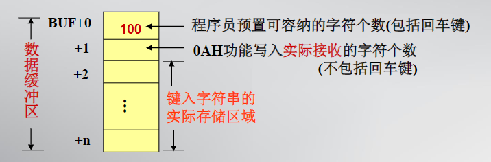
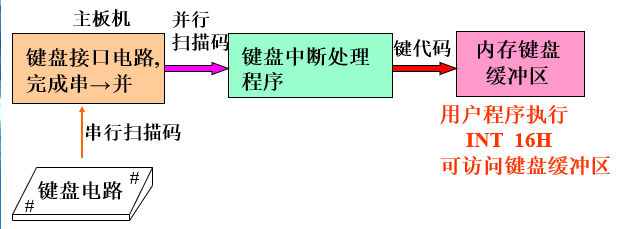
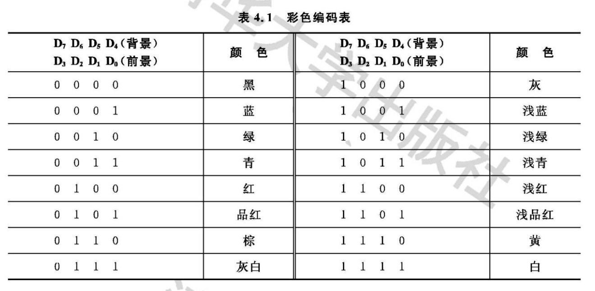

# 第四章 汇编语言程序

## 汇编语言程序结构

一个完整的源程序[^简化]在结构上必须做到：

- 用方式选择伪指令说明执行该程序的微处理器类型
- 用段定义语句定义每一个逻辑段
- 用`ASSUME`语句说明段约定
- 用汇编结束语句说明程序结束

[^简化]:  目前汇编语言源程序框架有完整段定义格式和简化段定义格式两种，**MASM5.0**版本开始支持了简化的段定义语句。为考虑兼容性，本书的*DOS*汇编程序都采用完整的汇编语言段定义格式。

完整的段定义格式

1. 方式选择伪指令[^方式选择伪指令]
2. 段定义语句`定位参数,链接参数,‘分类名’ （仅作了解）`
3. 段约定语句
4. 汇编结束语句
5. 返回DOS语句

```assembly
.586                      ;方式定义
    ;定义数据段
    DATA    SEGMENT USE16
            ……
    DATA    ENDS
     ;定义代码段
    CODE    SEGMENT USE16
            ASSUME  CS:CODE,DS:DATA  ;说明段约定
BEG:MOV     AX,DATA          ;BEG为启动地址
    MOV     DS,AX
　　　　　　......
    MOV     AH,4CH
 INT     21H              ;返回DOS
    CODE    ENDS
END     BEG              ;汇编结束
```

[^方式选择伪指令]: 通常,方式选择伪指令放在程序的头部,做为源程序的第一条语句。不设置方式选择伪指令与设置.8086是等价的。

### 汇编源程序的编程格式

汇编源程序有两种编程格式:
EXE文件的编程格式：只能生成扩展为EXE 的可执行文件；
COM文件的编程格式：可以生成扩展为COM的可执行文件。
COM文件的执行级别高于EXE文件,同名的BAT(批处理)文件执行级别最低。

- E许源程序使用多个逻辑段（包括据段、堆栈段、代码段及其它逻辑段）；在实模式下,每个逻辑段的目标块不超过64K；适合编写大型程序。
- COM文件的编程格式适合于编写中小型程序。汇编语言要求COM须符合以下规定:
  - 源程序只允许使用一个逻辑段,即代码段,不允许设置堆栈段;
  - 需使用定位ORG伪指令将程序的启动指令存放在代码段偏移地址为100H的单元。
  - 程序使用的数据,可以集中设置在代码段的开始或未尾;
  - 代码段目标块小于64K。

## DOS调用

DOS的4个组成部分中IBMBIO.COM是DOS系统的核心模块,为基本I/O设备处理程序,与BIOS一起完成数据输入和数据输出的基本操作DOS和BIOS均有若干子功能可以被用户程序调用，称为“DOS调用”和“BIOS调用”

```assembly
MOV AH,[功能号];设置入口参数
INT n;分析出口参数
```

- 其中n值因子程序不同而可能不同，比如：ROM BIOS有n=5~1FH,DOS有n=20H, 21H, 23~2AH,2EH,2FH,33H和67H等几种情况。有的n只对应一个子程序，有的n对应很多子程序。
- 调用结束后一般都有出口参数，这些出口参数常放在寄存器中，通过出口参数可以知道功能调用的成功与否。
- 在DOS功能子程序调用中，我们把通过INT21H来实现的子程序调用称为DOS系统功能调用。

| 功能号  | 功能                                         | 入口参数                                                    | 出口参数                                                     |
| ------- | -------------------------------------------- | ----------------------------------------------------------- | ------------------------------------------------------------ |
| **01H** | 等待键入一个字符，有回显，响应Ctrl_C         | 无                                                          | AL=按键的ASCII码。[^01H]                                     |
| **02H** | 显示一个字符，响应Ctrl_C[^02H]               | DL=待显字符的ASCII码                                        | 无                                                           |
| **07H** | 等待键入一个字符，无回显，**不响应Ctrl_C**   | 无                                                          | AL＝按键的ASCII码,若AL＝0,需再次调用该项功能才能在AL中得到按键的扩展码。 |
| **08H** | 等待键入一个字符，无回显，**响应Ctrl_C**     | 无                                                          | AL＝按键的ASCII码,若AL＝0,需再次调用该项功能才能在AL中得到按键的扩展码。 |
| **09H** | **显示字符串**，响应Ctrl_C[^09H]             | DS:DX＝字符串首地址,字符串必须以‘$'(即ASCII码24H)为结束标志 | 无                                                           |
| **0AH** | 等待键入一串字符送到用户程序数据缓冲区[^0AH] | DS:DX指向放键入字符的缓冲区。缓冲区定义形式规定为：         | 存放于缓冲区的字符串，以回车键结尾。                         |



[^01H]: 若AL＝0,表明按键是功能键,光标键,需再次调用本功能,才能返回按键的扩展码。
[^02H]: 本功能在屏幕的当前位置显示一个字符,光标右移一格,如果是在一行末尾显示字符,则光标返回下一行的开始格。如果是在屏幕的右下角显示字符,光标返回时屏幕要上滚一行。**注意**：该功能要破坏AL寄存器的内容。
[^09H]: 9号功能破坏AL寄存器的内容。该项功能从屏幕当前位置开始,显示字符串,遇到结束标志‘$’时停止,‘$’字符并不显示

[^0AH]: 缓冲区定义的第二个字节由系统设置，其余由用户定义；输入的字节数少于定义的字节数，缓冲区其余字节补零；输入的字节数大于定义的字节数，后来输入的字符丢弃且响铃警告。DOS功能调用

## BIOS功能调用

主板EPROM中固化有基本I/O系统程序—BIOS,它是最接近硬件的驱动程序,BIOS中的许多子程序可被用户程序调用,调用这些子程序称为“BIOS功能调用”。



```assembly
MOv AH,[功能号]; 设置入口参数
INT n  ;分析出口参数
;其中INT n为软中断指令, n为中断类型码.不同n的代表不同的设备驱动程序
```

### 键盘输入功能调用（INT 16H）

| 功能号 | 功能                                                | 入口参数 | 出口参数                                                     |
| ------ | --------------------------------------------------- | -------- | ------------------------------------------------------------ |
| 00H    | 读取键入的一个字符，无回显，响应Ctrl_C,无键入则等待 | 无       | AL=键入字符的ASCII码。若AL=0，则AH=键入键的拓展码            |
| 01H    | 查询键盘缓冲区                                      | 无       | Z标志＝0,表示有键入,键代码仍留在键盘缓冲区中,此时AL＝键入字符的ASCII码,AH＝键入字符的扩展码。<br> Z标志＝1,表示无键入。 |

### BIOS屏显功能调用的调用模式（int 10H)



```assembly
MOV AH,[功能号];预置入口参数
INT 10H;下面分析出口参数
```

| 功能号 | 功能                                  | 入口参数                                                     | 出口参数                                                     |
| ------ | ------------------------------------- | ------------------------------------------------------------ | ------------------------------------------------------------ |
| 00H    | 设置屏幕显示方式<br>与21H 8号功能类似 | AL=0 40x25 黑白文本方式<br>AL=1 40x25 彩色文本方式<br>AL=2 80x25 黑白文本方式<br>AL=3 80x25 彩色文本方式 | 无                                                           |
| 01H    | 查询键盘缓冲区                        | 无                                                           | Z标志为0，表示有键入，键入码仍留在键盘缓冲区中，此时AL=键入字符的ASCII码，AH=键入字符的拓展码<br>Z=1,表示无键入 |
| 02H    | 预置光标位置                          | BH=显示页号<br/>DH=行号<br/>DL=列号                          | 无                                                           |
| 03H    | 读取光标的当前位置                    | BH=显示页号                                                  | CH、CL＝光标顶部扫描线、低部扫描的行号<br/>DH、DL=光标在屏幕上的行、列号 |
| 0EH    | **显示一个字符**                      | AL=待显示的ASCII码[^0EH]                                     | 无                                                           |
| 13H    | **显示字符串**                        | AL=0~3<br/>BH=显示页号，BL=属性字[^BIOS13H]<br>CX=串长度<br>DH、DL=字符串显示的起始行、列号<br>ES:BP=待显字符串首地址 | 无                                                           |

[^BIOS13H]: AL＝0、1时有效.13H功能是唯一能显示彩色字符的子功能字

[^0EH]: 21H的02功能与INT 10H的0EH功能 一致，但是前者待显示字符放在DL中，后者放在AL中

## 程序设计方法

- 分析题意，确定算法
- 根据算法画出程序框图
- 根据框图编写程序
- 上机调试程序
- 执行程序

从结构上讲，一般汇编程序可分为：

- 顺序程序
- 分支程序
  - 简单分支
  - 复合分支
  - 多分支
- 循环程序
  1. 循环准备
  2. 循环体
  3. 循环控制
- 子程序
- 宏指令

## 汇编程序结构语法

### 子程序设计

参照第三章介绍相关置零时的内容[子程序调用及返回指令](第3章%20汇编语言指令集.md####子程序调用及返回指令)
子程序: 相对独立的程序，当程序中要多次完成某一操作时，为了简化整体程序，增强程序可读性，常常把“完成某一操作”的功能设计成一个子程序，供调用。

1. 子程序用PROC/ENDP定界
2. 子程序分为：段内子程序、段间子程序、无参数子程序、有参数子程序
3. 在子程序设计中
   - 要明确地定义出这个子程序的入口参数和出口参数，使调用者能方便地使 用子程序。
   - 在子程序中在合理地保存主程序和子程序都用到的寄存器和存储单元，以使主程序能正确地运行。

参数传送主要有两种方式：

1. 利用寄存器传送参数
2. 利用堆栈传送参数
3. 利用某个内存单元 传送参数

```assembly
COMPUTE   PROC
  MOV     AX，0
AGA:    ADD     AX，[BX]         ;求和
  ADD     BX，2
  LOOP   AGA
        RET                      ;返回断点XYZ
    COMPUTE   ENDP
    CODE      ENDS
    END     BEG
```

### 宏指令程序设计

“宏”是源程序中的一段有独立功能的程序代码。与子程序类似，可以简化程序设计，增强可读性，但是参数传递更加方便。
宏指令指用户自定义的指令。编程序时候，将多次使用的功能用一条宏指令来代替。经过定义的宏，通过写出宏名，即可调用。宏指令的定义一般放在程序的首部，不放在任何逻辑段中。

**无参数宏指令的定义语句格式：**

```assembly
宏指令名称 MACRO
 宏体
   ENDM
```

有参数宏指令的定义语句格式：

```assembly
宏指令名称     MACRO    哑元表
 宏体
  ENDM
```

宏指令的定义与调用

- MACRO/ENDM是宏体的定界语句
- 宏体经过定义之后，宏指令的名称就是一条宏指令，可以像CPU指令那样去使用
- 在代码段中放置一条宏指令就是宏调用
- 编译时汇编程序用宏体替换宏指令

有参宏指令的哑元表

- 一串用逗号间隔的形式参数表
- 哑元是没有值的符号，用它(们)代表宏体中出现的操作码助记符、操作数(立即数、寄存器操作数、内存操作数)
- 调用时，宏指令行要有和哑元一一对应的实元表
- 实元可以是立即数、寄存器操作数以及没有PTR运算符的内存操作数

```assembly
CRLF    MACRO
MOV     AH,0EH
MOV     AL,0DH
INT       10H
MOV     AL,0AH
INT       10H
ENDM
;令光标返回到下一行的开始格,CRLF是宏指令的名称。宏体经过定义之后,宏指令的名称CRLF就是一条宏指令,在代码段中放置一条CRLF就是宏调用。

MOV     AH, 2
MOV     DL, ’A’
INT       21H
CRLF
;编译时汇编程序用宏体替换宏指令,因此执行CRLF后,光标返回下一行始格。
```

LOCAL 指令`LOCAL 标号名表`

1. LOCAL伪指令要放在宏定义之中，是MACRO定界语句以下的第一条语句
2. 标号名表是用逗号间隔的一串标号名，它们是宏体中出现的所有标号的集合
3. 宏体中出现的标号称为局部标号，使用LOCAL伪指令后的局部标号允许和源程序中的其它标号、变量重名

```assembly
.486
CMPDISP  MACRO   NN
LOCAL    LAST,NEXT
MOV   DL,0     ;DL清0
LAST:    CMP BEN,NN    ;比较
         JC  NEXT      ;BEN ＜ NN 转
         INC DL        ;DL加1
         SUB BEN,NN    ;BEN-NN→BEN
         JMP LAST
NEXT:    ADD DL,30H
         MOV AH,2
         INT 21H     ;显示
ENDM
```
