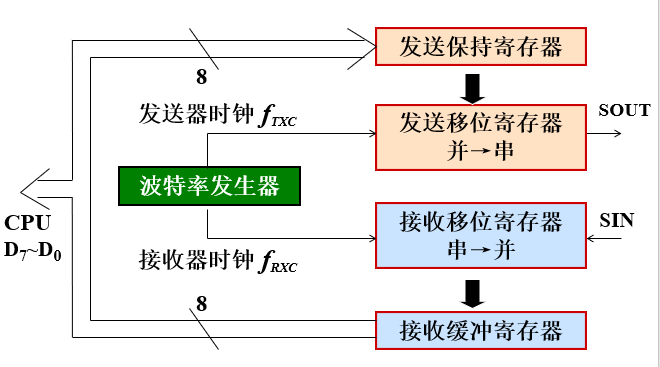
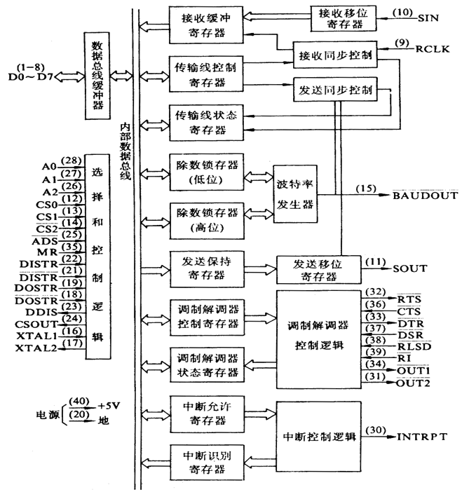
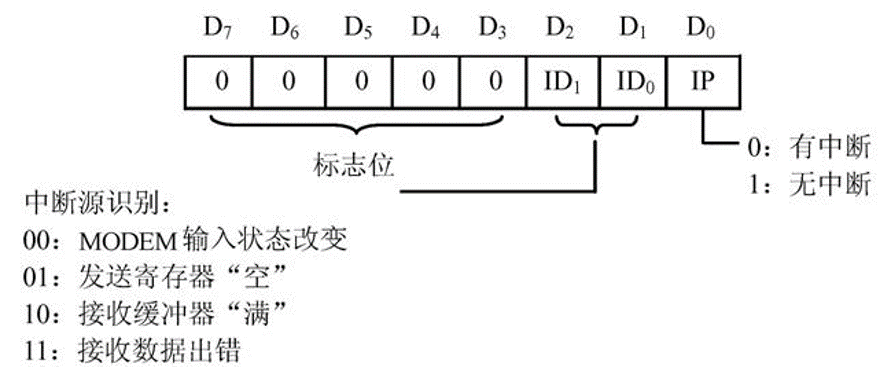
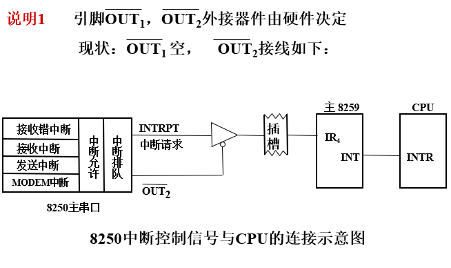
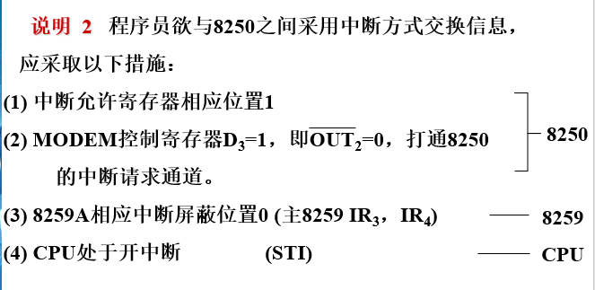
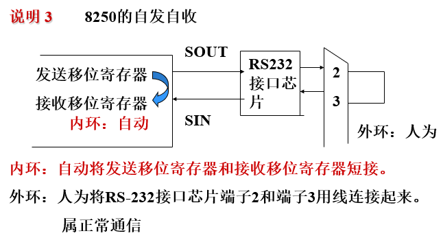
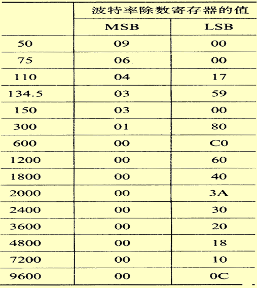
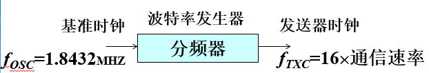
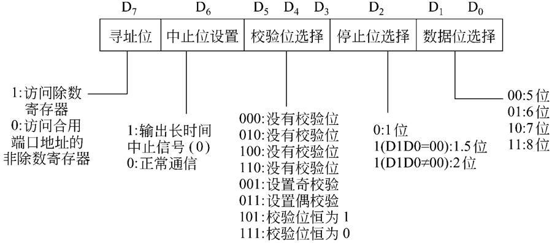

# 可编程串行异步通信接口芯片**8250**

- 能实现数据串$\Leftrightarrow$并变换，实现全双工异步通信支
- 持异步通信协议，数据格式、通信速率等由初始化编程设定
- 内部有MODEM控制器，可直接和MODEM相连
- 内部有中断机制，CPU可用查询、中断方式与之交换信息
- 以Ins 8250为核心器件的微机串行口，基于RS-232C标准，微机之间既通过连接调制解调器实现通过电话线路的远距离通信，也可以
- 直接连接进行短距离的点到点通信。

[toc]

 PC机有2个串行口，端口I/O地址分别为主串口`3FXH`、辅串口`2FXH`（高档微机中，8250的功能被一些多功能芯片取代）



## 串行数据发送过程

CPU执行OUT指令，将待发送的数据→发送保持寄存器暂存，当发送移位寄存器空闲时自动装入，后者在发送器时钟控制下将并行数据添加起始位、校验位、停止位，一位一位发出。

## 串行数据接收过程

在接收器时钟控制下，接收移位寄存器一位一位地接收串行数据，自动的去掉起始位、校验位、停止位，并转换成并行数据→接收缓冲寄存器暂存，在接收过程中对一帧数据自动进行校验。

## 内部结构



8250 内部寄存器从使用角度来说有10个，分成三类

- 一类：2个数据寄存器
  - 发送保持寄存器    3F8H/2F8H        写入
  - 接收缓冲寄存器    3F8H/2F8H        读出
- 二类；5个命令字寄存器
  - 通信线控制寄存器   3FBH/2FBH
  - 2个除数寄存器    3F8H/2F8H (低位 )    3F9H/2F9H  (高位)
  - 中断允许寄存器                     3F9H/2F9H
  - MODEM控制寄存器             3FCH/2FCH
- 三类：3个状态寄存器
  - **通信线状态寄存器**   3FDH/2FDH
  - 中断识别寄存器    3FAH/2FAH
  - MODEM 状态寄存器   3FEH/2FEH

 传输线寄存器控制寄存器的8250自身

### 发送保持寄存器(3F8H/2F8H)

该寄存器保存CPU传送来的并行数据，并转移至发送移位寄存器
注：只有在发送保持寄存器空闲时，CPU才能写入下一个数据。

### 接收缓冲寄存器(3F8H/2F8H)

接收移位寄存器，去掉起始位，校验位和停止位，转换成并行数据，转换后的并行数据存入接收缓冲寄存器，等待CPU接收。
注：只有当一帧数据收完后，CPU才能用IN指令读接收缓冲寄存器

### 通信线状态寄存器(3FDH/2FDH)

该寄存器提供数据传输的状态信息，其各位含义如下：

- D0位：接收数据准备好(接收缓冲器满)标志位。 D0＝1，表示接收器已接收到一帧完整的数据，并已转换成并行数据，存入接收缓冲寄存器。(CPU接收数据时一定要查询)
- D1位：溢出错标志位。D1＝1，表示接收缓冲器中的字符未取走，8250又接收到新输入的数据，造成前一数据被破坏。
- D2位：奇偶错标志位。D2＝1，表示收到的数据有奇偶错。
- D3位：帧错(接收格式错)标志位。D3＝1，表示接收的数据没有正确的停止位。
- D4位：线路间断标志位。D4＝1，表示收到长时间“0”信号(即中止信号)。
- D5位：发送保持寄存器空闲标志位。D5＝1，表示数据已从发送保持寄存器转移到发送移位寄存器，发送保持寄存器空闲，CPU可以写入新数据。当新数据送入发送保持寄存器后， D5置0。
- D6位：发送移位寄存器空闲标志位。D6＝1，表示一帧数据已发送完毕。当下一个数据由发送保持寄存器移入发送移位寄存器时，该位被置0。
- D7位：恒为0。
注意：D0位(接收数据准备好)和D5位(发送保持寄存器空)是串行接口最基本的标志位，它们决定了CPU能不能向8250进行读写操作，只有当D0＝1时，CPU才能读数；只有当D5=1或D6=1时，CPU才能写数据。
**说明**：
寄存器中的各位置1时，如相应的中断允许位也为1，则
- D0 = 1 ， 产生接收中断
- D5 = 1 ， 产生发送中断
- D1~D4 = 1，产生“字符错”中断

执行下列操作后，该状态寄存器中的相应位自动执行
数据-->发送保持寄存器             D5 = 0
通信线状态寄存器内容-->AL         D1~D4 = 0
接收缓冲寄存器内容-->AL           D0 = 0
发送保持寄存器内容-->移位寄存器   D6 = 0

#### 通信线状态寄存器示例

```assembly
; PPT page36 通信线状态寄存器
; 示例1 利用主串口查询方式发送一个"A"
SCANT: MOV DX,3FDH;通信线状态寄存器
  IN AL,DX
  TEST AL,20H;0010 0000
  JZ SCANT;判断D5是否为1
  MOV DX,3F8H;发送保持寄存器
  MOV AL,'A'
  OUT DX,AL
;示例2：利用辅串口查询方式接受一个字符
SCANR: MOV  DX,2FDH
   IN  AL,DX
  TEST AL,01H;0000 0001
  JZ   SCANR;判断D0是否为1
  MOV DX,2F8H;接收缓冲寄存器
  IN AL,DX
```

注：`TEST`命令是不改变AL的`OR`指令，所以当对应位为1时结果不为1，Z标为0。

### 中断允许寄存器(3F9H/2F9H)

8250有4级中断（按优先级从高到底为）

1. 接收线路状态中断(接收数据错 OE、PE、FE、BI 置1 产生中断)；  高
2. 接收缓冲器满；
3. 发送缓冲器空；
4. MODEM 状态中断(MODEM应答联络信号状态变化产生中断)。      低

当上述 4 种类型的中断有一种或多种出现时，在中断允许寄存器的配合
作用下，8250 可输出 中断请求 信号。
该寄存器的D7～D4位恒为0。D3～D0位表示8250的4级中断是否被允许。

- D0＝1，允许接收到一帧数据后，内部提出“接收中断请求”。
- D1＝1，允许发送保持寄存器空时，内部提出“发送中断请求”
- D2＝1，允许接收出错时，内部提出“接收数据错中断请求”。
- D3＝1，允许MODEM状态改变时，内部提出“MODEM中断请求”。

### 中断识别寄存器(3FAH/2FAH)

由于8250仅能向CPU发出一个总的中断请求信号，为了识别是哪一个中断源引起的中断，应当在转入中断服务程序之后，读取中断识别寄存器的内容进行判断，然后再转入相应的处理程序。

如果只有一个中断，就不需要进行中断识别

```assembly
MOV   DX，3FAH
IN   AL，DX
CMP   AL，0
JZ   MODEM中断
CMP   AL，2
JZ   发送中断
CMP   AL，4
JZ   接收中断
CMP   AL，6
JZ   字符错中断
```

### MODEM控制寄存器(3FCH/2FCH)

- D0位＝1,使引脚DTR＝0,从而使RS-232C引脚DTR为0,表示数据终端准备好
- D1位＝1，使引脚RTS＝0，从而使RS-232C引脚RTS为0,表示8250请求发送
- D2位＝1，使引脚OUT1＝0，系统机上没有使用。
- **D3位＝1，使引脚OUT2＝0，8250能送出中断请求。**
- D4位通常置0，设置8250工作在*正常收/发*方式；
- 若D4位置1，则8250工作在*内部自环方式*，即发送移位寄存器的输出在芯片内部被回送到接收移位寄存器的输入
- D7～D5位恒为0。

使用联络线的话，通常将0和1位置一

#### 说明

out2与INTRPT相与，才送出中断







### 除数寄存器( 高8位3F9H/2F9H ，低8位3F8H/2F8H )

除数寄存器   —— 存放分频系数，由两部分组成，高8位送入MSB，低8位送入LSB。

8250 波特率与分频系数(除数锁存器中的值) 的关系：





8250内部的波特率发生器是软件控制的可编程的分频器
$$
\frac{f_{OSC}}{\text{分频系数}}=16\times \text{通信速率}
$$

$$
\therefore \text{分频系数(即除数)}=\frac{1.8432MHz}{16\times \text{通信速率}}
$$

### 通信线控制寄存器(3FBH/2FBH)

​    该寄存器主要用于指定串行异步通信的数据格式。



### MODEM状态寄存器(3FEH/2FEH)

该寄存器反映8250与通信设备(如MODEM)之间联络信号的当 前状态以及这些信号的变化情况。

- D7～D4记录了4个输入引脚的状态电平：
  - D7＝1 表示输入引脚RLSD＝0，MODEM收到来自电话线的载波信号。
    - D6＝1 表示输入引脚RI＝0，MODEM收到振铃信号。
    - D5＝1 表示输入引脚DSR＝0, MODEM做好了发送准备，请8250准备接收。
    - D4＝1 表示输入引脚CTS＝0, MODEM做好了接收准备，8250可以发送数据
- D3～D0记录了上一次读取该寄存器后，上述引脚是否发生过电平变化。
  - D3＝1 表示输入引脚RLSD有电平变化。
  - D2＝1 表示输入引脚RI有电平变化。
  - D1＝1 表示输入引脚DSR有电平变化。
  - D0＝1 表示输入引脚CTS有电平变化。
