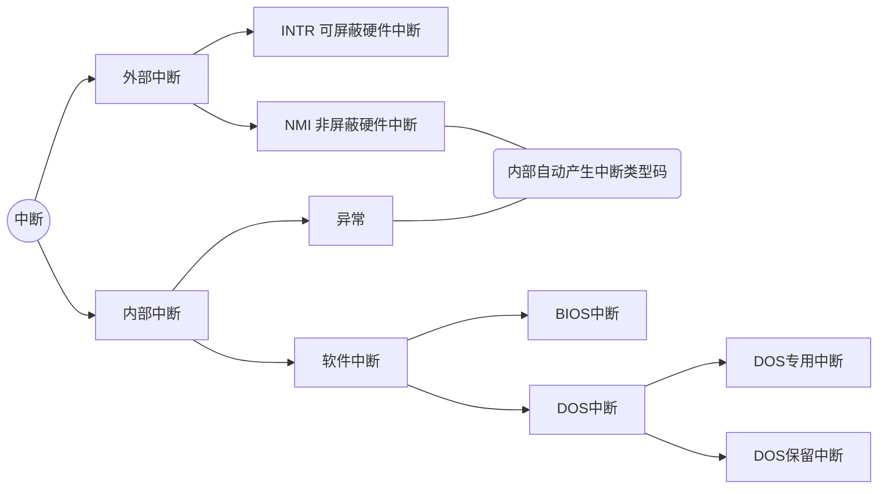
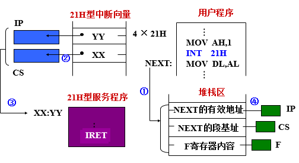
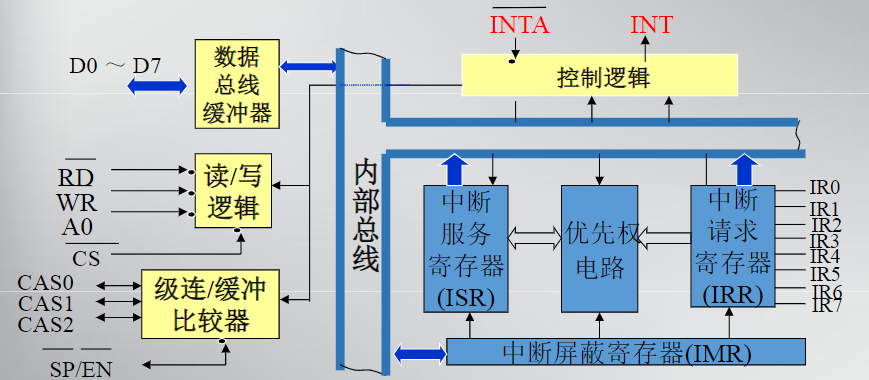
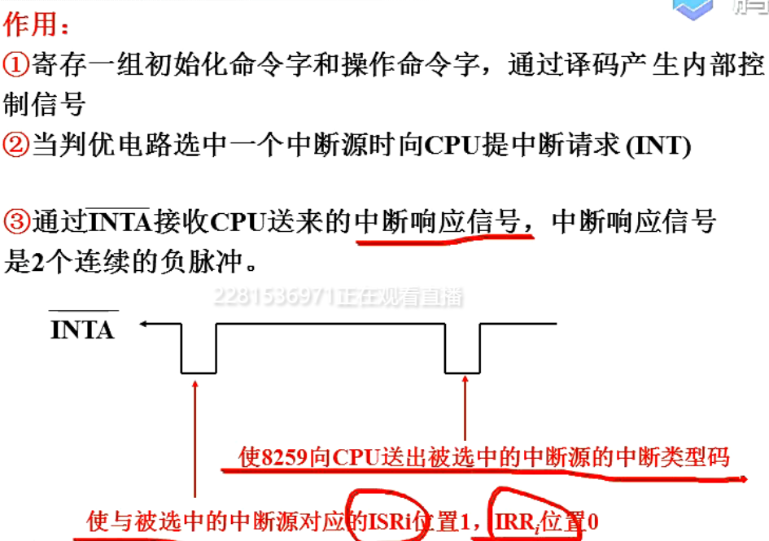
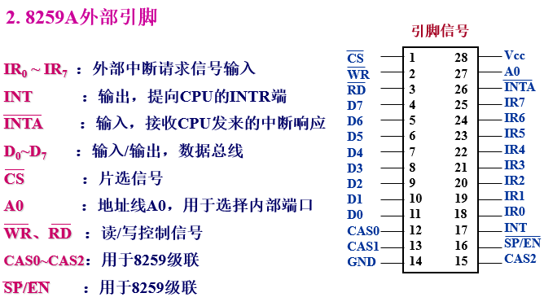
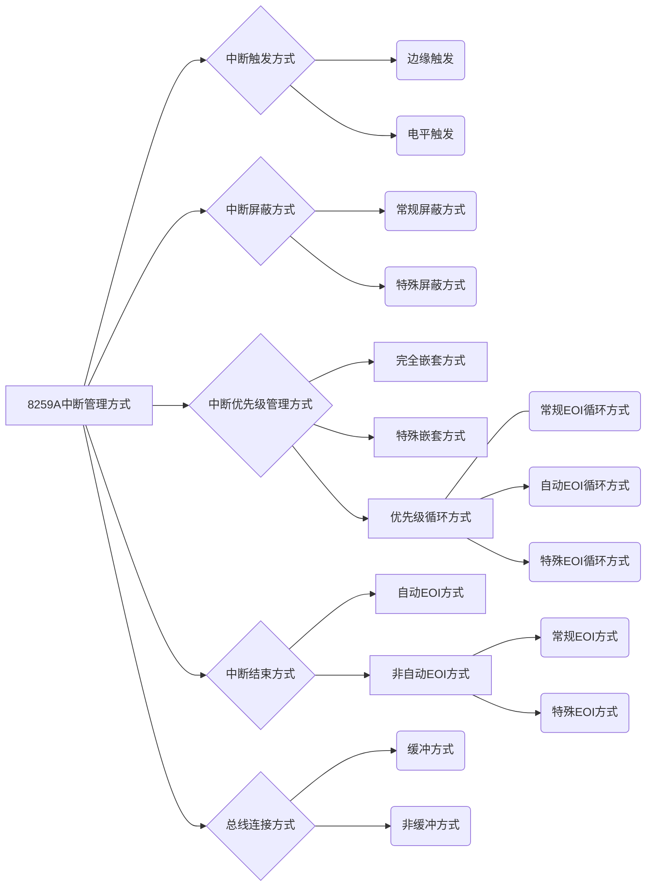
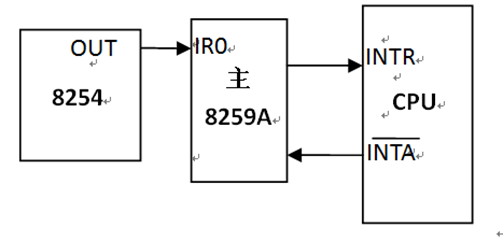
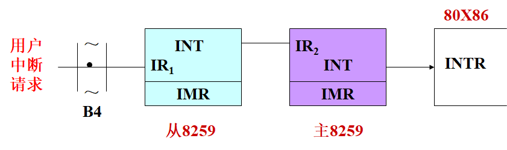

# 第八章 中断系统

分三次课讲述、各次的重点为

- 中断的分类（知道了解）以及**中断向量**（计算，知道中断向量的引导过程，操作系统响应中断的过程）
- 微机系统中的可屏蔽中断，中断管理器8259（工作过程，自己语言描述，8259级联，pc机中时两片管理15级，从接在主的IR2上）

## 8.1 中断的基本概念

### 8.1.1 中断概念的引入及描述

查询方式当外设数据未准备好时,CPU需要不断查询外设数据是否准备好的状态,效率低

#### 中断方式示意(以输入中断为例)

 ```sequence
title:CPU采用中断方式与外设交换信息（以输入为例）
participant 现行程序
participant 输入接口
participant 输入设备

现行程序->输入设备:1.启动
note over  现行程序:2.cpu执行现行程序
输入设备->输入接口:3.数据
输入接口->现行程序:4.中断请求
现行程序->输入接口:5.中断响应
note over 现行程序:6.中断现行程序并执行中断服务子程序
输入接口->现行程序:7.数据
note over 现行程序:9.结束子程序返回现行程序
 ```

#### **中断**的定义

**中断**：CPU在执行程序的过程中，由于某种外部或内部事件的作用，使CPU停滞当前正在执行的程序而转去为该事件服务，待事件服务结束后，又能自动返回到被中止了的程序中继续执行的过程。

- 被中断的源程序称为**主程序**；
- 中断处理程序称为**中断服务子程序**
- 主程序被中止的地方，称为**断点**，也就是**下一条**指令所在内存的地址

### 8.1.2 中断源及中断分类

**中断源**：是能够引发CPU中断的信息源，分为两大类。

- （CPU）外部中断源（硬件中断源）*通过I/O接口发中断*
  - I/O设备 如键盘、显示器、打印机
  - 数据通道 如磁带、磁盘
  - 时钟 如8254 0#，由此引发的中断
  - 故障源 如掉电、存储器奇偶校验错误
- （CPU）内部中断源（软件中断源、异常）
  - 执行INT软件中断指令 如执行指令`INT 21H`
  - CPU指令执行产生的异常 如被0除、单步执行

**中断的分类**中断根据*中断源*可以分为：

- 由外部事件所引发的中断，即由CPU以外的设备发出，并由CPU的中断请求信号引脚输入所引发的中断称为**外部中断**，也称为硬件中断（80x86中 **INTR 可屏蔽硬件中断，NMI非屏蔽硬件中断**）
- 由CPU内部事件，即由*CPU硬件故障*或*程序执行中的指令所引发的中断*称为**内部中断**。内部中断可以进一步分为**软件中断和异常**。
  - 执行有定义的INT N指令而引发的中断称为*软件中断*。软件中断可分为BIOS中断、DOS中断。DOS中断又分为DOS专用中断、DOS保留中断、用户可调用的DOS中断以及保留给用户开发的中断。
  - 由于CPU本身故障、程序故障等引发的中断，称为*异常*。



外部中断和异常的发生是随机的。

常见的**异常**：

- 除法错中断——当除法结果溢出或者除数为0时，发生的中断。
- 单步或陷阱中断——执行每条指令后，如果标志寄存器的T标志（陷阱标志）为1时,则产生中断。
- 断点中断——CPU执行“INT 3”指令后,进入相应的中断服务程序。INT 3指令通常用于调试程序时设置程序断点。
- 溢出中断——CPU执行“INT 4”指令,或者标志寄存器O标志（溢出标志）为1时，执行“INTO”指令，进入相应的中断服务程序。

### 8.1.3 中断类型码

#### 中断类型码

为了区别各种不同的中断，微机系统给每一个中断分配了一个中断号n，即中断类型码，其取值范围是0~255。微机系统可以处理**256种中断**，在这256个中断中，intel 在它各种微处理器中都保留了前32个（0—31）为系统所专用，后224个可由用户设定。

| 常用中断号 | 对应中断 |
| ---------- | -------- |
| 0型中断|除法错中断|
|1型中断|单步或陷阱中断|
|2型中断|非屏蔽硬件中断|
|3型中断|断点中断|
|4型中断|溢出中断|
|5型中断|屏幕打印|
|08H～0FH型中断|可屏蔽硬件中断|
|10H～1FH型中断|BIOS中断（10H，16H）|
|20H～3FH型中断|DOS中断（21H）|

[中断优先级](#中断优先与中断分级)

#### 中断向量

:star:**中断向量是实模式下，中断服务子程序的入口地址。**它由两部分组成：

- 服务程序入口的偏移地址  2个字节(4n~4n+1)
- 服务程序所在代码段的段基址          2个字节(4n+2~4n+3)

例：若四个单元内容为11H，22H，33H，44H，则入口地址为：(中断向量表的表地址与中断类型的关系）
$$
偏移地址：2211H\ \ 段基址：4433H\\
2211H+44330H=46541H
$$

#### 中断向量表

中断类型码通过一个**地址指针表**与**中断服务程序的入口地址**相联系。实模式下：该表称为**中断向量表**；保护模式下该表称为中断描述符表。

##### 中断向量表的设置

CPU规定：在实模式下，中断向量表需设置在系统的RAM最低端的1k单元（000000H~003FFH）$256(2^8)\times4=2^{10}=1k$

$n型中断向量存放在4n\sim4n+3$

##### **中断向量表的初始化**

谁（DOS,BIOS,用户）设计（开发)的程序，由谁将它写入中断向量

DOS设计的两个专门用于中断向量的读出与写入的代码

| INT21H | 35H子功能           | 25H子功能                                                    |
| ------ | ------------------- | ------------------------------------------------------------ |
| 功能   | **读出**n型中断向量 | **写入**n型中断向量                                          |
| 入口   | AL=中断类型码       | DS=中断服务程序所在代码段的段基址<br>DX=中断服务程序入口的偏移地址<br>AL=中断类型码 |
| 出口   | ES:BX=n型中断向量   | 无                                                           |

##### 将中断向量写入中断向量表

```assembly
;方法一、用户自己编写程序填写中断向量
CLI;关中断
PUSH DS;程序会破坏DS内容，所以先将DS保存
MOV AX,0000H
MOV DS,AX;给DS赋值
MOV BX,4*n
MOV AX,OFFSET SERVICE
MOV [BX],AX;写入程序起始地址的偏移地址，这里需要使用DS间址寻址，省略了段基址
MOV AX,SEG SERVICE
MOV [BX+2],AX;写入段基址
POP DS
STI:开中断
;采用方法2，使用DOS自带的子程序，对应的程序段如下：
CLI
PUSH DS
PUSHA
MOV AX,SEG SERVICE
MOV DS,AX;写入段基址
MOV DX,OFFSET SERVICE;写入偏移地址
MOV AH,25H
MOV AL,n
INT 21H
POPA
POP DS
STI

```

##### 中断响应和处理过程

微机系统各种类型中断的响应和处理过程不完全相同，主要区别在于中断类型码的获得方式不同,当CPU获得了中断类型码后的处理过程基本类似。
|中断类型|中断类型码|
|---|---|
|非屏蔽硬件中断请求|CPU内部会**自动**产生中断类型码**2**|
|可屏蔽硬件中断请求|当CPU处于开中断状态时，由**外部中断控制器**将相应的中断类型码送给CPU|
|异常|中断类型码也是**自动**形成的|
|INT n指令|中断类型码即为**指令**中给定的n|

CPU获得了中断类型码n后，中断的处理过程如下：

1. F寄存器→栈(保存中断处理之前的F状态)使F中的

   - T标志置0——禁止单步操作

   - I标志置0——CPU处于关中断状态

2. 断点地址→栈<br>先：断点基地址(CS) →栈，后：断点偏移地址(IP)→栈

3. CPU从4n ～4n+3单元取出n型服务程序入口地址→IP:CS,从而转入n型中断服务程序。

4. 服务程序执行完毕，执行中断返回指令。中断返回指令的功能是按顺序恢复断点处的IP值、CS值和之前保护的相应中断前的标志寄存器内容→标志寄存器。CPU根据恢复后的CS:IP返回断点，继续执行主程序。

##### 中断向量的引导作用



##### 中断服务子程序的结构

```assembly
ISR PROC
 ;保护现场
 ;中断处理

 ;恢复现场
 ;中断返回是IRET弹出六个字节，RET不能实现要求
ISR ENDP
```

## 8.2 多级中断管理

### 1.中断优先与中断分级

当有多个中断源在同一时刻提出请求时，CPU对中断响应的次序称中断优先级。（中断响应的次序是用排队器硬件实现的，可以由程序控制改变实际的中断处理次序）[前文提到的中断类型码](#中断类型码)

80X86响应中断的优先级如下：

||中断类型优先级|
|---|---|
|1| 除法错中断**最高**|
|2|软件中断INT n ↓|
|3| 断点中断↓|
|4|溢出中断INTO↓|
|5| NMI中断↓|
|6| INTR中断↓|
|7| 单步中断**最低**|

### 2.禁止中断与中断屏蔽

- 禁止中断：产生中断请求后，CPU不能中断现行程序的执行。
- 中断屏蔽：用程序有选择地封锁部分中断，而允许其余部分仍可得到响应。
- 软件中断与硬件中断甚至可以“相互中断”

### 3.中断嵌套

中断嵌套：在执行中断服务程序时，仍可再响应中断申请。

### 4.中断系统应具备的基本功能

- 对于硬件中断,接口电路应具备‘屏蔽’和‘开放’的功能,这种功能由程序员通过软件去控制。
- 能实现**中断判优**（中断排队），当有多个中断源提出请求时,应能优先响应高级别的中断源。
- 能够实现**中断嵌套**。
- 响应中断后，能自动**转入**中断处理，处理完毕能自动**返回**断点。

## 8.3 80x86的中断指令

1. 开中断指令`STI`<br>功能：使F寄存器中I标志置1,CPU处于开中断状态。[^开关中断指令]
2. 关中断指令`CLI`<br>功能：使F寄存器中I标志置0,CPU处于关中断状态。[^开关中断指令]
3. 软件中断指令`INT  n`<br>n为中断类型码,n为0～255之间**有定义**的无符号整数。功能：无条件转向n型中断服务子程序。
4. 中断返回指令[^iret]`IRET`<br>功能：依次从栈顶弹出**6个元素**→IP,CS,F。如果栈顶是INT   n  的断口地址，则执行IRET后，返回断点，否则不能。SP会变大（加六）
5. 溢出中断指令`INTO`<br>功能：先判别F寄存器中O标志位是否为1，如是则直接调用类型为4的中断子程序，用以处理溢出中断。

### INT n指令的执行过程

[与中断响应和处理过程的1.2.3步一致](#中断响应和处理过程)

❌软件中断指令 INT n,n是0~255之间的任意无符号整数。:negative_squared_cross_mark:

[^开关中断指令]:指的是CPU可否响应中断请求，STI和CLI只对可屏蔽**硬件**中断INTR有用
[^iret]:IRET 是中断服务子程序的出口指令

## 8.4 中断控制器8259A

### 8.4.1 8259A功能

1. 一片8259A中断控制器可以管理8级中断
2. 每一级中断都可以通过设置内部屏蔽字进行屏蔽或允许。
3. 在中断响应周期，8259A可以向CPU提供相应的中断类型码。
4. 8259A是很复杂的中断控制器，可以通过编程从中断触发方式、中断屏蔽方式、中断优先级管理方式、中断结束方式和总线连接5个方面对中断进行管理。

#### 8259A主从级联

2片8259A通过级联，采用1主1从的方式，可管理15级中断。

通过级联，采用1主8从的方式，可扩展管理**64级中断**。

### 8.4.2 8259A结构



#### 8259A内部结构

1. **中断请求寄存器( IRR)**<br>寄存引脚IR0～IR7的中断请求信号,IRRi位置1，表明IRi引脚上有了中断请求信号
2. **中断屏蔽寄存器(IMR)**<br>寄存程序员写入的中断屏蔽字，屏蔽字某位=1(IMRi位=1),则与该位对应的中断请求信号(IRRi位)就不能送到中断优先权电路
3. **优先权电路（排队电路）**
   1. 比较同时送达优先权电路的中断请求，哪一个级别最高。
   2. 比较CPU正为之服务的中断源和刚进入优先权电路的中断源，哪一个级别更高。
   3. 通过判优‘选中’其中级别最高的中断源，然后通过控制电路，从INT端向CPU提中断请求。中断控制器8259A内部结构
   4. **中断控制电路**
   5. **中断服务寄存器**(ISR)
      1. 通过判优电路IRR0位的请求被选中，8259A向CPU发中断请求，通过$\overline{INTA}$收到第一个中断响应信号后，ISR0位置1，IRR0位置0。ISR0位置1，表明CPU正在准备(或正在)执行IR0的服务程序。
      2. 反之，如果ISR0位由1 →0，表明IR0的中断服务程序执行完了所以ISR的每一位都是响应中断源的中断服务标志位。中断控制器8259A内部结构
4. **数据总线缓冲器**
   - 完成与CPU数据线配接
   - 接收初始化命令字，操作命令字
   - 当收到第二个中断响应脉冲时，通过他们向CPU送出被选中的中断源的中断类型码n
5. **读/写控制模块**
6. **级联/缓冲比较器**

控制逻辑电路



#### 8259A外部中断



#### 中断控制器8259A中断过程——CPU响应可拼比硬件中断的过程

1. 首先由中断请求寄存器寄存加到引脚$IR_0\sim IR_7$的中断请求
2. 在中断屏蔽寄存器的管理下，没有被屏蔽的中断请求被送到优先权电路判优
3. 经过优先权电路的判别，选中当前级别最高的中断源，然后从引脚INT向CPU发出中断请求信号
4. CPU满足一定条件后，向8259A发出2个中断响应信号（负脉冲）
5. 8259A从引脚$\overline{INTA}$收到第1个中断信号之后，立即使中断服务寄存器中与被选中的中断源对应的那位置1，同时把中断请求寄存器中的相应位清0
6. 从引脚$\overline{INTA}$收到第2个中断响应信号后，8259A把选中的中断源类型码n，通过数据线送往CPU
7. 在实模式下，CPU从$4\times n\sim 4\times n +3$单元取出该中断源的中断向量$\longrightarrow IP 、CS$，从而引导CPU执行该中断源的中断服务程序

### 8.4.3 8259A的中断管理方式



#### 中断触发方式

- **边沿触发**（$IR_i$出现上升沿表示有中断请求）
- **电平触发**（$IR_i$出现高电平表示有中断请求）

80X86微机中采用**边沿**触发方式

#### 屏蔽中断源方式

- **常规屏蔽方式**<br>MR屏蔽字决定了允许或禁止某位$IR_i$所对应的中断：$IM_i=1$禁止，$IM_i=0$允许
- **特殊屏蔽方式**
  - 提供了允许较低优先级的中断能够得到响应的特殊手段
  - 当一个中断被响应时，仅屏蔽同级别的再次中断，而允许较低和较高级别的中断源中断正在执行的当前中断服务程序
  80x86采用**常规屏蔽**方式

#### 中断优先级管理方式

#### 优先级控制方式

1. 固定优先级方式
   - 所有中断请求$IR_i$的中断优先级固定不变
   - 加电后8259A的默认方式，默认优先级顺序从高到低为$IR_0\sim IR_7$
2. 循环优先级方式
   - 中断源轮流处于最高优先级，即自动中断优先级循环
   - 某中断请求$IR_i$被处理后，其优先级别自动降为最低，原来比它低一级的中断上升为最高级

#### 中断嵌套方式

在中断处理过程中允许被更高优先级的时间所中断称为中断嵌套。8259A有两种中断嵌套方式：

- 普通全嵌套方式(默认方式)<br>一中断正被处理时，只有更高优先级的时间可以打断当前的中断处理过程而被服务
- 特殊全嵌套方式<br>一中断正被处理时，允许统计或更高优先级的事件可以打断当前的中断处理过程

80x86采用**固定优先级、普通全嵌套**方式

#### 中断结束处理方式

当某一$IR_i$中断被服务时，ISR中的相应位$ISR_i=1$.当服务结束后，则必须清零该$ISR_i$。当服务结束后，则必须清零该$ISR_i$位。使$ISR_i=0$是通过向8259A发出中断结束命令（EOI命令）实现的。

三种EOI命令

- 自动EOI（AEOI）[^AEOI]——（自动EOI方式）
- 指定EOI（SEOI）[^SEOI]——（特殊EOI方式）
- 非指定EOI（NSEOI）[^NSEOI]——（正常/常规EOI方式)

80x86微机中采用NSEOI（常规中断结束）方式

[^AEOI]:在第2个INTA#结束时，由8259A使ISR~i自动复位；:star:因不保留当前正在服务的中断的状态，故AEOI不能用于中断嵌套方式
[^SEOI]:由CPU发出一条SEOI命令，该EOI命令中指出了所要复位的ISR的位号。:star:用于特殊屏蔽方式
[^NSEOI]:由CPU发出正常EOI命令没,该EOI命令使ISR~i=1的位中优先级最高的那一位复位。:star:用于普通全嵌套方式

#### 8259A的编程

20H是最常用的中断结束命令字

### 8.5.2 非屏蔽中断

:star:**非屏蔽中断**：输入到CPU的NMI引脚的请求信号引发的中断

:star:响应非屏蔽中断的**条件**

1. 有非屏蔽中断请求，没有DMA请求
2. 一条指令执行完

#### CPU响应非屏蔽中断的过程

CPU在每一条指令的最后一个时钟周期,检测NMI引脚。处理器不屏蔽来自NMI的中断请求。
    处理器在响应NMI中断时，不从外部硬件接收中断向量号。在80X86中，非屏蔽中断所对应的中断向量号固定为2。为了非屏蔽中断的嵌套，每当接受一个NMI中断，处理器就在内部屏蔽了再次响应NMI，这一屏蔽过程直到执行中断返回指令IRET后才结束。所以，NMI处理程序应以IRET指令结束。

### 8.5.3 可屏蔽中断

**可屏蔽中断**：输入到INTR引脚的中断请求信号，引发的中断

**硬件中断的级别**：DMA请求>非屏蔽中断>可屏蔽中断

#### 1.响应可屏蔽中断的条件

1. 有可屏蔽中断请求，没有DMA请求，没有非屏蔽中断请求
2. CPU一条指令执行完毕
3. CPU处于开中断状态（I标为1）

#### 2.CPU响应可屏蔽中断过程

​    CPU在每一条指令的最后一个时钟周期，检测INTR引脚，当检测到有可屏蔽中断请求时，在满足上述条件的前提下，通过总线控制器向系统8259A发出中断响应信号(2个负脉冲)。在获得8259A送来的中断类型码之后，在实模式下查询中断向量表,从而转向相应中断源的中断服务程序。

#### 3.PC系列机可屏蔽中断的硬件结构

##### 1.使用2篇8259级连，管理15级中断

##### 2.中断源与中断类型

| **主8259** | **中断源** | **中断类型** | **从8259** | **中断源**   | **中断类型**   |
| ---------- | ---------- | ------------ | ---------- | ------------ | -------------- |
| **IR0**    | **日时钟** | **08H**      | **IR0**    | **实时时钟** | **70H**        |
| **IR1**    | **键盘**   | **09H**      | **IR1**    | **用户中断** | **71H改向0AH** |
| **IR2**    | **从8259** | ---          | IR2        | 保留         | 72H            |
| IR3        | 辅串口     | 0BH          | IR3        | 保留         | 73H            |
| IR4        | 主串口     | 0CH          | IR4        | 保留         | 74H            |
| IR5        | 并行口2    | 0DH          | IR5        | 协处理器     | 75H            |
| IR6        | 软盘       | 0EH          | IR6        | 硬盘         | 76H            |
| IR7        | 并行口1    | 0FH          | IR7        | 保留         | 77H            |

##### 3.系统分配的8259口地址

|            | **中断屏蔽寄存器口地址** | **接收中断结束命令的寄存器口地址** |
| ---------- | ------------------------ | ---------------------------------- |
| **主8259** | **21H**                  | **20H**                            |
| **从8259** | **0A1H**                 | **A0H**                            |

##### 4.硬件可屏蔽中断的中端级别

##### 5.中断结束命令

1. 命令字为`20H`
2. 接入`主8259A` IR~0~ ,IR~1~,IR~3~~IR~7~的中断源，其服务程序结束要向主8259送中断结束命令字
3. 接入从8259的中断源，经主`8259A`的IR2向INTR提中断请求，其服务程序结束应分别向主、从8259各送一个中断结束命令字 。

```assembly
;接入主8259A  IR0，IR1，IR3 ～IR7的中断源其服务程序结束要向主8259送中断结束命令字
MOV  AL，20H
OUT  20H，AL
;恢复现场
IRET
;接入从8259的中断源，经主8259A的IR2向INTR提中断请求，其服务程序结束应分别向主、从8259各送一个中断结束命令字 。
MOV    AL，20H
OUT    20H，AL
OUT    0A0H，AL
;恢复现场
IRET
```

## 8.6 微型计算机系统中用到的中断及应用举例

### 8.6.1 日时钟中断

> BIOS系统规定：40H:6CH～40H:6FH这4个单元
(共32位)为日时钟计数器，每55ms加1次，计数
 到:001800B0H，为24小时,其计数值供系统软件使用。
> 系统启动时CPU执行BIOS中的一段程序，读取CMOS实
时时钟电路的时间值→计数值→40:6CH～40:6FH做
为日时钟计数器的计数初值。

 

1. **中断源**：系统8254 0#计数器，每55ms发一次中断请求
2. **中断类型**：08H
3. **日时钟中断处理流程**：（CPU转入8型中断后，完成下列工作）
  1.开中断，保护现场（DS压栈）
  2.40H给DS，对“日时钟级数器”加1
  3.测算软驱马达关闭时间
  4.执行 `INT 1CH`
  5.向主8259送中断结束命令
  6.恢复现场DS,`IRET`

**关于1CH服务程序**（软件中断）

- 8# 服务程序，每隔55ms在DS=40H的前提下，调用一次1CH服务程序，之后又返回8型
- 所以1CH中断是日时钟的附加中断，用户可开发新的1CH中断服务程序(完成每55ms一次的定时操作)取代系统原来的中断服务子程序

**软件中断和硬件中断可以相互嵌套**他们之间的优先级是指当中断请求同时发生时高优先级的中断优先响应，不存在低优先级无法打断高优先级的说法

#### 系统日时钟中断的开发应用

1. 置换中断向量，（08H或1CH）
   - 当用户程序的某项定时操作，其定时周期等于55ms的整数倍时，可定义用户程序的定时操作为1CH中断。此时需要置换1CH型中断向量，调用DOS系统25H号子程序把用户定时中断服务程序入口地址写入4×1CH～4×1CH ＋3单元。
   - 当用户程序的定时操作,其定时周期不等于55ms的整数倍或者小于55ms时，需要重新对8254 0#计数器进行编程，定义输出周期为用户定时周期与55ms的**最大公约数**，此时用户中断服务程序为08H型，此时需要置换08H型中断向量，调用DOS系统25H号子程序把用户定时中断服务程序入口地址写入4×08H～4×08H＋3单元。
2. 用户中断服务程序结束
   - 若用户定时中断定义为1CH型，服务程序结束前不需要向主8259A送结束命令。
   - 若用户定时中断定义为08H型， 服务程序结束前，需要先向主8259A送中断结束命令
3. 中断服务程序的执行时间
   - 定时中断服务程序的执行时间，必须远远小于定时中断的时间间隔
4. 避免DOS重入（DOS不允许重入）

### 8.6.2 键盘中断

可屏蔽硬件中断

1. 键盘**中断源**是主板键盘接口电路
2. **中断类型**：09H

### 8.6.3 实时中断

1. **中断源**是主板中的实时时钟电路
2. **中断类型**：70H

### 8.6.4 用户中断

1. 系统用户中断的**中断源**是系统的ISR总线**B~4~**端子（IRQ9）引入的中断请求信号，接到从8259的IR1经过INT接到主8259的IR2端，通过INT接到INTR
2. **中断类型**：`71H`（转向0AH）
3. **系统用户中断处理流程**BIOS设计的71H型中断服务程序处理流程如下：
   1. 开中断、保护现场；
   2. 向从8259A发出中断结束命令
      `MOV     AL, 20H;OUT     0A0H, AL`
   3. 执行`INT  0AH`,转向`0AH`服务程序。
      `0AH`服务程序是用户预先设计好的,其中断向量已经存放在系统RAM `4×0AH～4×0AH＋3`单元。

用户中断是微机系统为用户开发可屏蔽中断预备的中断口。在用户中断程序的设计中，需要采取以下措施：

1. 把外扩中断源的中断请求(由低电平到高电平的跃变)接入ISA总线B4端子
2. 开放用户中断
3. 置换中断向量

CPU响应用户中断后，自动转向“71H型”服务程序。根据BIOS设计的71H型中断服务程序处理流程，可以知道，用户自行设计的用户中断服务程序类型可以是“71H”，也可以是0AＨ。

1. 定义用户中断服务程序为`0AH型`，置换0AH型中断向量,调用DOS系统25H号子程序把用户中断的服务程序入口地址写入4×0AH～4×0AH＋3单元。

2. 定义用户中断服务程序为`71H型` ，置换71H型中断向量,调用DOS系统25H号子程序把用户中断的服务程序入口地址写入4×71H～4×71H＋3单元。

#### 用户中断请求的途径



- 用户中断请求从ISA总线B4端子(IRQ9)引入，经过主8259，从8259二级中断管理，最后由主8259向CPU提中断。

- 只有从8259IMR1置0，主8259IMR2置0，其中断请求方能送到CPU。 （日时钟中断和键盘中断是开放的）

```assembly
;实现用户中断必须对主、从8259应用编程,保证中断申请由8259中断控制器提向CPU
IN       AL，0A1H
AND       AL，11111101B
OUT       0A1H，AL      ; 从8259

IN        AL，21H
AND       AL，11111011B
OUT       21H,AL        ;开放主8259中断
```
